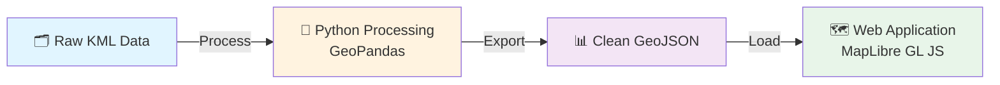

# Estado Novo - Mapeamento dos Apelos

Interactive mapping project documenting historical appeals during the Estado Novo period in Rio de Janeiro, related to expropriations for the construction of Avenida Presidente Vargas.

## 📋 Table of Contents

- [📊 Project Overview](#-project-overview)
  - [🏗️ Project Architecture](#️-project-architecture)
  - [📊 Data Flow](#-data-flow)
  - [🗺️ How the Web Application Works](#️-how-the-web-application-works)
  - [📁 Data Structure](#-data-structure)
  - [🎯 What It Does](#-what-it-does)
  - [👥 Authors](#-authors)
- [📚 Documentation](#-documentation)
  - [🎯 Choose Your Path](#-choose-your-path)
  - [📖 Web Application Documentation](#-web-application-documentation)
- [🚀 Quick Start - Web Deployment](#-quick-start---web-deployment)
  - [Local Development](#local-development)
  - [Deploy to Production](#deploy-to-production)
- [📁 Project Structure](#-project-structure)
- [🗺️ Web Application Features](#️-web-application-features)
- [💻 Development Setup](#-development-setup)
  - [Python Environment (Data Processing)](#python-environment-data-processing)
  - [Web Application](#web-application)
- [📦 Deployment Options](#-deployment-options)
- [🔧 Technologies](#-technologies)
  - [Frontend](#frontend)
  - [Backend/Processing](#backendprocessing)
  - [Infrastructure](#infrastructure)
- [📊 Data Sources](#-data-sources)
- [🎯 Usage Examples](#-usage-examples)
  - [View the Web Map](#view-the-web-map)
  - [Process New Data](#process-new-data)
  - [Update QGIS Project](#update-qgis-project)
- [🚀 Deployment Workflow](#-deployment-workflow)
  - [Recommended Professional Workflow](#recommended-professional-workflow)
- [📈 Performance](#-performance)
- [🔒 Security](#-security)
- [📄 License](#-license)
- [🤝 Contributing](#-contributing)
- [📧 Support](#-support)
- [🙏 Acknowledgments](#-acknowledgments)
- [📚 Additional Resources](#-additional-resources)

## 📊 Project Overview

This is a **historical mapping project** that documents appeals (apelos) during the Estado Novo period in Rio de Janeiro, specifically related to expropriations for the construction of Avenida Presidente Vargas.

### 🏗️ **Project Architecture**

The project has **three main components**:

1. **Data Processing Pipeline** (Python/GeoPandas)
2. **QGIS Desktop Mapping** (`.qgz` project file)
3. **Interactive Web Application** (TypeScript/Vite)

### 📊 **Data Flow**



1. **Raw Data**: Historical KML files containing appeal locations and documents
2. **Processing**: Python notebook (`00_processing_KML.ipynb`) converts and cleans the data
3. **Output**: Clean GeoJSON files with structured appeal information
4. **Web App**: Interactive map displays the processed data

### 🗺️ **How the Web Application Works**

The web app (`web/src/main.ts`) is built with:

- **MapLibre GL JS**: Open-source mapping library
- **TypeScript**: Type-safe development
- **Vite**: Fast build tool and dev server
- **MapTiler**: Professional map tiles

**Key Features:**
- **Interactive clustering**: Points cluster at lower zoom levels for better performance
- **Detailed popups**: Click markers to see appeal information and links to original documents
- **Layer control**: Toggle different data layers (appeals, neighborhoods)
- **Responsive design**: Works on desktop and mobile
- **Professional UI**: Modern, accessible interface

### 📁 **Data Structure**

The processed data includes:

```json
{
  "type": "FeatureCollection",
  "features": [
    {
      "properties": {
        "Name": "R. Sen. Furtado, 61",
        "Description": "Lavanderia Confiança - desapropriação...",
        "Link": "https://drive.google.com/file/d/..."
      },
      "geometry": {
        "type": "Point",
        "coordinates": [-43.2187139, -22.9119948, 0.0]
      }
    }
  ]
}
```

### 🎯 **What It Does**

1. **Loads geospatial data** from GeoJSON files
2. **Displays interactive map** centered on Rio de Janeiro
3. **Shows appeal locations** as clustered points
4. **Provides detailed information** when clicking markers
5. **Links to original documents** (Google Drive links)
6. **Allows layer toggling** for different data types

This is essentially a **digital humanities project** that makes historical research data accessible through an interactive web interface, allowing users to explore the spatial distribution of appeals during a significant period in Rio de Janeiro's urban development.

### 👥 **Authors**

- **Francesca Dalmagro Martinelli** - Research and GIS Analysis
  - Email: arq.francesca.martinelli@gmail.com

- **Cristofer Antoni Souza Costa** - Web Development and Data Processing
  - Email: cristofercosta@yahoo.com.br

## 📚 Documentation

Complete guides for all skill levels - now organized in the `docs/` folder:

### 🎯 **Choose Your Path:**

**👋 New to the project?** → Start with [docs/user-guides/quick-start.md](docs/user-guides/quick-start.md)

**🗺️ Want to use the map?** → Read [docs/user-guides/user-guide.md](docs/user-guides/user-guide.md)

**💻 Need to deploy?** → Follow [docs/deployment/deployment-guide.md](docs/deployment/deployment-guide.md)

**🔧 Developer setup?** → Check [docs/developer-guides/complete-documentation.md](docs/developer-guides/complete-documentation.md)

**⚡ Quick commands?** → Use [docs/reference/quick-reference.md](docs/reference/quick-reference.md)

### 📖 **Documentation Hub:**

| Category | Documents | Purpose |
|----------|-----------|---------|
| **[docs/user-guides/](docs/user-guides/)** | 2 docs | End-user instructions |
| **[docs/developer-guides/](docs/developer-guides/)** | 3 docs | Technical development |
| **[docs/deployment/](docs/deployment/)** | 3 docs | Production deployment |
| **[docs/reference/](docs/reference/)** | 2 docs | Quick lookup |
| **[docs/api/](docs/api/)** | 1 doc | Technical reference |

**📚 [Complete Documentation Index](docs/README.md)** - Your central hub for all documentation

**Quick Links:**
- 🚀 [Quick Start](#quick-start---web-deployment)
- 🗺️ [Use the Map](docs/user-guides/user-guide.md)
- 📖 [Full Documentation](docs/developer-guides/complete-documentation.md)
- ⚡ [Quick Reference](docs/reference/quick-reference.md)
- 🌐 [Documentation Hub](docs/README.md)

## 🚀 Quick Start - Web Deployment

### Local Development

```bash
cd web
chmod +x setup.sh
./setup.sh
```

Visit http://localhost:3000

### Deploy to Production

**Easiest: Vercel (1 command)**
```bash
cd web
npm install -g vercel
vercel
```

**See full deployment guide:** [docs/deployment/deployment-guide.md](docs/deployment/deployment-guide.md)

## 📁 Project Structure

```
geo/
├── web/                          # Web application
│   ├── src/                      # TypeScript source
│   ├── package.json              # Dependencies
│   ├── vite.config.ts            # Build config
│   ├── Dockerfile                # Container config
│   └── README.md                 # Web-specific docs
├── processed_data/               # Clean GeoJSON data
│   ├── apelos_clean.geojson      # Main dataset
│   └── filtro_bairros.geojson    # Neighborhood boundaries
├── raw_data/                     # Original KML files
├── DATA.RIO/                     # Rio de Janeiro base layers
├── src/geoprocess/               # Python processing tools
├── process.ipynb                 # Data processing notebook
├── apelos.qgz                    # QGIS project
├── DEPLOYMENT.md                 # Detailed deployment guide
└── README.md                     # This file
```

## 🗺️ Web Application Features

- **Interactive clustering** - Points cluster at lower zoom levels
- **Detailed popups** - Click to view appeal information and documents
- **Responsive design** - Works on desktop and mobile
- **Professional UI** - Modern, accessible interface
- **Fast performance** - Optimized builds, CDN delivery
- **SEO optimized** - Meta tags for social sharing

## 💻 Development Setup

### Python Environment (Data Processing)

```bash
# Install package
pip install -e .

# Open Jupyter notebook
jupyter notebook process.ipynb
```

### Web Application

```bash
cd web
npm install
npm run dev
```

## 📦 Deployment Options

| Platform | Difficulty | Cost | Best For |
|----------|-----------|------|----------|
| **Vercel** | ⭐ Easy | Free | Automatic deployments, global CDN |
| **Netlify** | ⭐ Easy | Free | Open source, forms |
| **GitHub Pages** | ⭐⭐ Medium | Free | Simple hosting |
| **Docker/VPS** | ⭐⭐⭐ Advanced | $5+/mo | Full control |

**Detailed instructions:** See [docs/deployment/deployment-guide.md](docs/deployment/deployment-guide.md)

## 🔧 Technologies

### Frontend
- **Vite** - Fast build tool and dev server
- **TypeScript** - Type-safe JavaScript
- **MapLibre GL JS** - Open-source map rendering
- **MapTiler** - Map tiles and styling

### Backend/Processing
- **Python 3.12+**
- **GeoPandas** - Geospatial data processing
- **QGIS** - Desktop GIS application

### Infrastructure
- **GitHub Actions** - CI/CD pipeline
- **Docker** - Containerization
- **Nginx** - Web server

## 📊 Data Sources

- **Apelos (Appeals)**: Digitized from historical documents
- **Rio de Janeiro Base Layers**: DATA.RIO municipal data
  - Filtered Neighborhoods (Bairros Filtrados)

## 🎯 Usage Examples

### View the Web Map
1. Visit deployed site or run locally
2. Zoom and pan to explore Rio de Janeiro
3. Click markers to view appeal details
4. Access original documents via links

### Process New Data
1. Add KML/GeoJSON to `raw_data/`
2. Update `process.ipynb`
3. Export to `processed_data/`
4. Rebuild web application

### Update QGIS Project
1. Open `apelos.qgz` in QGIS
2. Modify layers and styling
3. Export map or use qgis2web plugin

## 🚀 Deployment Workflow

### Recommended Professional Workflow

```bash
# 1. Make changes
git checkout -b feature/my-update

# 2. Test locally
cd web && npm run dev

# 3. Build for production
npm run build
npm run preview

# 4. Commit and push
git add .
git commit -m "Add new features"
git push origin feature/my-update

# 5. Create pull request on GitHub

# 6. Merge to main → Auto-deploys to production
```

## 📈 Performance

- **First Load**: < 100KB (gzipped)
- **Time to Interactive**: < 2s on 3G
- **Lighthouse Score**: 95+ (all metrics)
- **Map Render**: < 500ms

## 🔒 Security

- HTTPS enforced on all platforms
- Environment variables for API keys
- CSP headers configured
- No sensitive data in frontend
- Regular dependency updates

## 📄 License

MIT License - See LICENSE file for details

## 🤝 Contributing

Contributions welcome! Please:
1. Fork the repository
2. Create a feature branch
3. Make your changes
4. Submit a pull request

## 📧 Support

For questions or issues:
- **GitHub Issues**: [Open an issue](https://github.com/yourusername/geo/issues)
- **Email**: Contact authors above
- **Documentation**: See [DEPLOYMENT.md](DEPLOYMENT.md) and [web/README.md](web/README.md)

## 🙏 Acknowledgments

- DATA.RIO for municipal geospatial data
- Historical archives for appeal documents
- OpenStreetMap contributors
- MapTiler for map tiles

## 📚 Additional Resources

- [Full Deployment Guide](DEPLOYMENT.md)
- [Web App Documentation](web/README.md)
- [QGIS Documentation](https://qgis.org/en/docs/)
- [GeoPandas Documentation](https://geopandas.org/)

---

**Quick Commands:**

```bash
# Local Development
cd web && ./setup.sh

# Deploy to Vercel
cd web && vercel --prod

# Deploy with Docker
cd web && docker-compose up -d

# Process data
jupyter notebook process.ipynb
```

For detailed deployment instructions, see [docs/deployment/deployment-guide.md](docs/deployment/deployment-guide.md).
