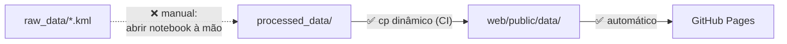
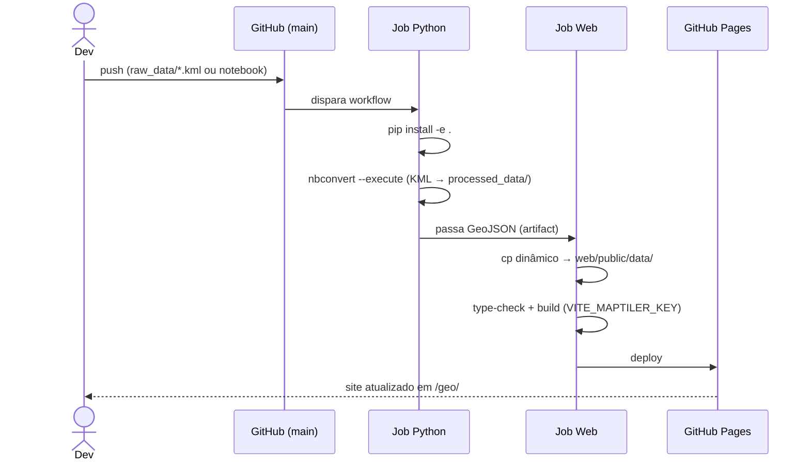

# Automação & correções — rumo a um pipeline autônomo

> Plano técnico para tornar o *pipeline* **totalmente autônomo**: meta de
> *um commit de um novo KML → site atualizado, sem passos manuais*.
> Lista as correções (bugfixes) e as automações necessárias. Cada item é
> ancorado em um arquivo real do repositório.
>
> **Status (atualizado):** as correções rápidas **B1–B6 estão resolvidas** e a
> automação **A2** (cópia dinâmica de dados) foi implementada. Resta a automação
> de maior esforço — executar o notebook na CI (A1, A3, A4) — para fechar o ciclo
> autônomo. Ver detalhe por item abaixo.

---

## 1. Onde estamos × onde queremos chegar

**Hoje**, após as correções, a única ruptura manual restante é a execução do notebook:



**Meta** — uma única ação dispara tudo:


---

## 2. Correções (bugfixes)

| # | Status | Problema | Arquivo(s) | O que foi feito |
|---|---|---|---|---|
| B1 | ✅ | **Nomes de dados divergentes**: o site lê `apelos_clean_tese.geojson` / `filtro_bairros_tese.geojson`, mas a CI copiava `apelos_clean.geojson` / `filtro_bairros.geojson` | `.github/workflows/deploy.yml`, `fix-and-deploy.sh` | Resolvido pela cópia dinâmica `cp processed_data/*.geojson` (ver A2) — a CI agora copia todos os artefatos, inclusive os `*_tese` |
| B2 | ✅ | **Entry point quebrado**: declarava `geoprocess = "geoprocess.cli:main"`, mas `src/geoprocess/cli.py` **não existe** | `pyproject.toml` | Seção `[project.scripts]` **removida** (o pacote é uma biblioteca, sem CLI) |
| B3 | ✅ | **Versão divergente**: `pyproject.toml` = `0.2.0`; `__init__.py` = `0.3.0` | `pyproject.toml` | `version` sincronizada para `0.3.0` |
| B4 | ✅ | **Dependências não declaradas**: só `geopandas` constava, mas o módulo importa `fiona`, `beautifulsoup4`, `shapely`, `pandas` | `pyproject.toml` | As quatro libs adicionadas a `dependencies` |
| B5 | ✅ | **URLs placeholder**: `yourusername` nas URLs | `pyproject.toml`, `README.md` | URLs apontadas para `eu-cristofer/geo` (inclui o link de *Issues* no README) |
| B6 | ✅ | **README com nomes de fase anterior**: `process.ipynb`, `01_mapeamento_de_apelos.qgz` | `README.md` | Atualizados para `02_processing_KML.ipynb` e `01_mapeamento_de_apelos.qgz`. **Correção desta análise:** `setup.sh` **existe** (`web/setup.sh`) — não era stale; a referência foi mantida |

---

## 3. Automações

### A1 — Executar os notebooks na CI (ruptura principal)

Hoje `raw_data → processed_data` depende de abrir o Jupyter à mão. Para automatizar, executar o notebook em modo *headless* na CI.

> 📘 **Ferramentas:** `jupyter nbconvert --to notebook --execute 02_processing_KML.ipynb` (padrão, sem dependência extra) ou **Papermill** (`papermill in.ipynb out.ipynb`), que permite parametrizar o caminho do KML de entrada.

Passos:
1. Adicionar um job (ou *step*) Python à CI que instala o pacote (`pip install -e .`) e executa o notebook.
2. Fazer o notebook **ler o KML mais recente de `raw_data/`** e **gravar em `processed_data/`** de forma determinística (sem caminhos absolutos).
3. *Commit* automático dos GeoJSON regenerados, ou passá-los diretamente ao job de build via *artifact*.

### A2 — Cópia de dados dirigida por configuração (elimina B1 na raiz) ✅

A lista de arquivos estava **duplicada** (em `main.ts` e em `deploy.yml`). **Implementada a opção simples:** tanto `.github/workflows/deploy.yml` quanto `fix-and-deploy.sh` agora executam `cp processed_data/*.geojson web/public/data/`, deixando de nomear arquivos um a um. Assim, `deploy.yml` não duplica mais a lista, e qualquer novo GeoJSON é copiado automaticamente.

- Evolução opcional (não implementada): um `web/public/data/manifest.json` lido tanto pelo build quanto por `main.ts`, eliminando também a lista `LAYERS` fixa.

### A3 — Disparar a CI também em mudanças de dados de origem

O `deploy.yml` aciona apenas em `web/**` e `processed_data/**`. Para o fluxo autônomo, incluir `raw_data/**` e os notebooks no gatilho:

```yaml
on:
  push:
    branches: [main]
    paths:
      - 'web/**'
      - 'processed_data/**'
      - 'raw_data/**'
      - '*.ipynb'
      - 'src/geoprocess/**'
```

### A4 — Fixar versões e ambiente reprodutível

- Declarar versões mínimas das libs Python (B4) para builds determinísticos.
- Fixar a versão do Python na CI (ex.: `actions/setup-python` com `3.12`).
- Opcional: *cache* de dependências para acelerar a execução.

---

## 4. Fluxo autônomo proposto (CI)



---

## 5. Checklist de execução

**Correções (rápidas, baixo risco) — concluídas**
- [x] B4 — declarar `fiona`, `beautifulsoup4`, `shapely`, `pandas` em `pyproject.toml`
- [x] B2 — remover o entry point quebrado `geoprocess.cli:main`
- [x] B3 — sincronizar a versão (`pyproject.toml` → `0.3.0`)
- [x] B5 — corrigir URLs do projeto (`pyproject.toml` + `README.md`)
- [x] B1 — alinhar nomes de GeoJSON (resolvido via A2)
- [x] B6 — atualizar `README.md` (notebook e `.qgz`; `setup.sh` confirmado existente)

**Automação (maior esforço)**
- [x] A2 — cópia dinâmica de `processed_data/*.geojson` (fonte única de verdade)
- [ ] A1 — executar o notebook na CI (`nbconvert`/Papermill)
- [ ] A3 — ampliar o gatilho do `deploy.yml` (`raw_data/**`, `*.ipynb`)
- [ ] A4 — fixar versões (Python + libs) na CI

> **Falta apenas A1 + A3 + A4** para o ciclo autônomo: executar o notebook na CI,
> ampliar o gatilho e fixar o ambiente. Feito isso, *adicionar um KML e dar push*
> basta para republicar o mapa.

---

*Cada problema e arquivo citado é verificável no repositório no estado atual.*
