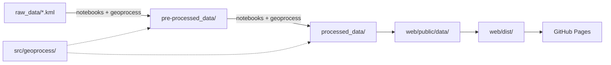
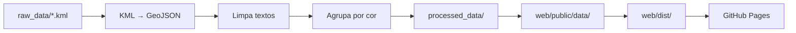
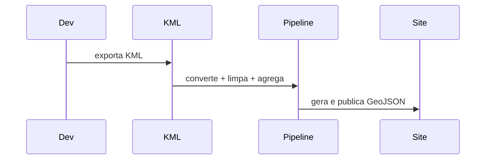
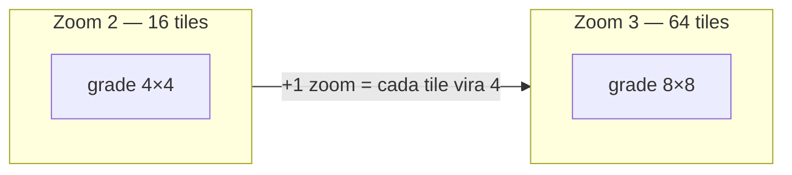
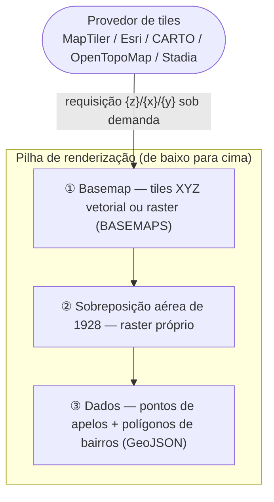
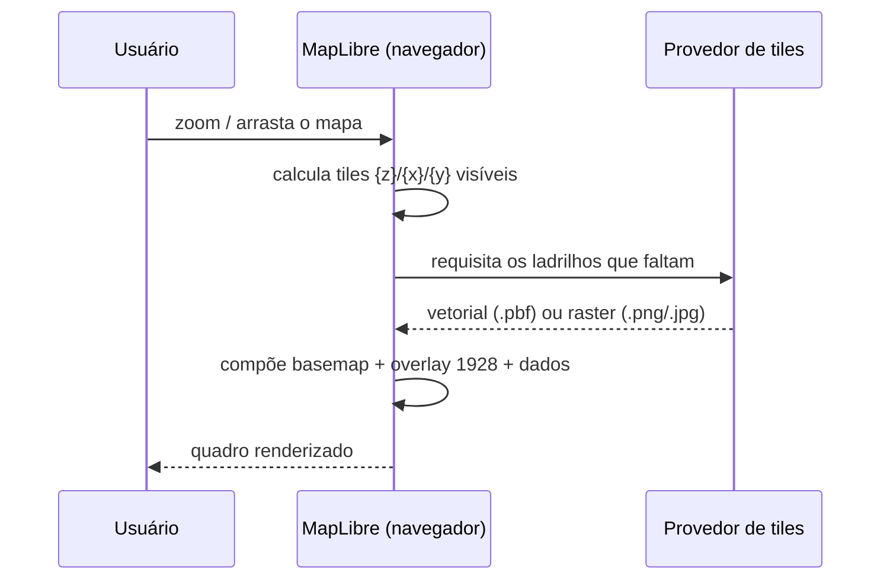
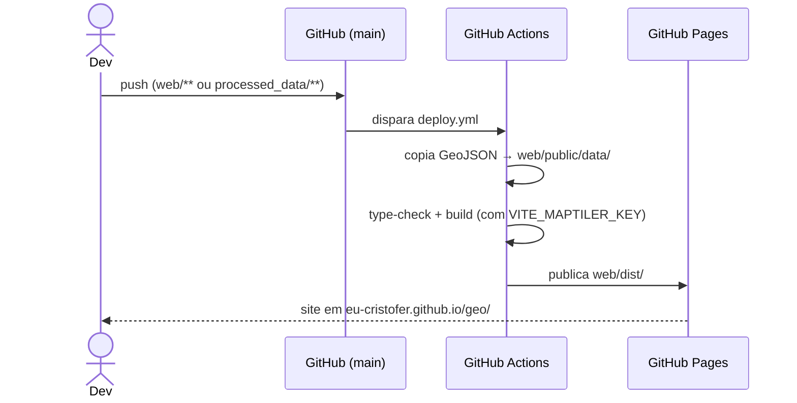

# Pipeline & *Tech Rider* — *Mapeamento dos Apelos*

> Descrição técnica do **pipeline** de dados e das **ferramentas** que o compõem,
> da fonte KML ao mapa publicado. Foco no processo e na pilha tecnológica;
> não cobre a metodologia de pesquisa.
> Ancorado integralmente nos arquivos do repositório.

---

## Resumo

Este documento descreve o *pipeline* de dados e a pilha tecnológica do projeto *Mapeamento dos Apelos*, que transforma uma fonte cartográfica colaborativa (KML exportado do Google My Maps) em um mapa interativo publicado na web. O processo é uma linha de produção unidirecional em sete estágios: conversão do KML em GeoJSON com preservação da cor de classificação (variável descartada pelas bibliotecas geoespaciais padrão), limpeza dos atributos textuais, agrupamento das feições por cor, recorte espacial por bairros, cópia dos artefatos finais para a aplicação, montagem (*build*) e publicação. O processamento é realizado em Python (GeoPandas, Fiona, Shapely, BeautifulSoup) por meio de notebooks Jupyter que importam o módulo local `geoprocess`, onde reside a lógica reutilizável das transformações. A camada de visualização é uma aplicação de página única em TypeScript que renderiza os dados com MapLibre GL JS sobre fundos cartográficos do MapTiler, e a publicação é automatizada por GitHub Actions no GitHub Pages. O objetivo é registrar, de forma verificável e reproduzível, cada ferramenta e cada etapa que tornam o site operacional, servindo de referência técnica para a documentação da pesquisa. As correções e automações pendentes para tornar o *pipeline* plenamente autônomo são tratadas em [`automacao.md`](automacao.md).

---

## 1. O pipeline em uma figura

O projeto é um *pipeline* unidirecional: o dado bruto entra de um lado, passa por estações de tratamento e sai como mapa publicável. Nada retorna — corrige-se na origem e roda-se de novo.



Este primeiro diagrama mostra o fluxo de dados de maneira geral: do arquivo KML de origem até o site publicado. Ele destaca as três pastas de maturidade dos dados e o papel do módulo `src/geoprocess/` como componente reutilizado pelos notebooks. As setas entre `raw_data/*.kml`, `pre-processed_data/` e `processed_data/` agora explicitam que essas transformações são feitas pelos notebooks em conjunto com o módulo `geoprocess`.

### 1.1 Fluxo detalhado do pipeline



Este segundo diagrama apresenta as etapas principais do processamento de dados. Cada bloco representa uma transformação aplicada pelo pipeline:

- `KML → GeoJSON`: conversão do KML e extração de cores
- `Limpa textos`: remoção de HTML e padronização das descrições
- `Agrupa por cor`: consolidação dos apelos por cor de marcador
- `processed_data/`: escrita dos artefatos finais
- `web/public/data/`: cópia para o site
- `web/dist/`: build da aplicação
- `GitHub Pages`: publicação final



O diagrama de sequência resume o fluxo humano-técnico em três etapas: o desenvolvedor exporta o KML, o pipeline processa os dados e o site é gerado/publicado.

| Estágio | Entrada | Ferramenta | Saída |
|---|---|---|---|
| 1. Converter | `raw_data/*.kml` | `convert_kml_to_geojson` + `get_kml_colors` | GeoJSON c/ coluna `Color` |
| 2. Limpar | GeoJSON bruto | `get_clean_text`, `get_first_url` | `pre-processed_data/*.geojson` |
| 3. Agrupar | apelos limpos | `group_all_colors_except` | `processed_data/apelos_clean_tese.geojson` |
| 4. Recortar bairros | `DATA.RIO/` | `point_in_feature`, `get_centroids` | `processed_data/filtro_bairros_tese.geojson` |
| 5. Copiar | `processed_data/*.geojson` | `cp` / `fix-and-deploy.sh` | `web/public/data/` |
| 6. Montar | `web/src/`, dados | `vite build` (`tsc && vite build`) | `web/dist/` |
| 7. Publicar | `web/dist/` | GitHub Actions → Pages | site em `/geo/` |

---

## 2. *Tech rider* (pilha tecnológica)

| Camada | Ferramenta | Versão | Papel |
|---|---|---|---|
| Linguagem (dados) | Python | ≥ 3.12 | Processamento geoespacial |
| Lib geo | GeoPandas | — | Leitura/escrita de geometrias |
| Lib geo | Fiona / Shapely | — | Driver KML e operações espaciais |
| Parsing | BeautifulSoup4 | — | Limpeza de HTML nas descrições |
| Tabelas | pandas | — | Manipulação de atributos |
| Módulo local | `geoprocess` | 0.3.0¹ | Funções do pipeline (`src/geoprocess/__init__.py`) |
| Caderno | Jupyter Notebook | — | Orquestração interativa do processamento |
| Runtime web | Node.js | 20 | Build do site (CI) |
| Linguagem (web) | TypeScript | ^5.6.2 | Código da aplicação |
| Build | Vite | ^5.4.8 | Dev server + bundling (`base: '/geo/'`) |
| Mapa | MapLibre GL JS | ^4.7.1 | Renderização do mapa interativo |
| Tiles | pmtiles | ^3.0.7 | Suporte a *tiles* empacotados |
| Fundos | MapTiler | serviço | Basemaps vetoriais **e** glyphs/fontes (chave `VITE_MAPTILER_KEY`) |
| Fundos (raster) | Esri / CARTO / OpenTopoMap / Stadia·Stamen | serviço | 5 *basemaps* raster alternativos (ver §5.2) |
| Qualidade | ESLint / terser | ^8.57.0 / ^5.44.0 | Lint e minificação |
| CI/CD | GitHub Actions | actions @v4 | Build e deploy automáticos |
| Hospedagem | GitHub Pages | — | Site público |

¹ Versão `0.3.0`, consistente entre `src/geoprocess/__init__.py` e `pyproject.toml`.

---

## 3. As ferramentas do módulo `geoprocess`

Funções em `src/geoprocess/__init__.py`, na ordem do pipeline:

| Função | Operação técnica |
|---|---|
| `get_kml_colors` | Percorre a árvore de estilos do KML (`StyleMap`→`CascadingStyle`→`Style`) e recupera a cor de cada marcador — que `geopandas`/`fiona` descartam |
| `convert_kml_to_geojson` | Lê o KML com `geopandas`, anexa a coluna `Color` via `get_kml_colors`, grava GeoJSON |
| `get_clean_text` | Remove tags e links do HTML da descrição, normaliza espaços |
| `get_first_url` | Extrai o primeiro link `http(s)` da descrição |
| `point_in_feature` | Testa contenção ponto-em-polígono, com reprojeção de CRS quando necessário |
| `split_by_color` | Particiona o `GeoDataFrame` em `(da cor X, demais)` |
| `aggregate_features_by_color` | Funde as feições de uma cor num ponto médio (preserva Z), concatena `Link`/`Description` |
| `group_features_by_color` | Atalho: `demais + feição agregada` |
| `group_all_colors_except` | Condensa **todas** as cores, **exceto** as excluídas (amarelo `fbc02d`); nomeia `"Apelos coletivos (<cor>)"` |
| `get_centroids` | Centroides precisos via reprojeção para Web Mercator (rótulos de bairro) |
| `save_geojson_pretty` | Grava GeoJSON indentado, para *diffs* legíveis no Git |

> A cor é uma variável transportada pelo pipeline: amarelo `fbc02d` permanece como pontos individuais; as demais cores são condensadas em pontos coletivos por `group_all_colors_except`.

---

## 4. Artefatos de dados

Três pastas = três estados de maturidade do mesmo dado:

- **`raw_data/`** — KML intocado, exportado do Google My Maps. Nunca editado à mão.
- **`pre-processed_data/`** — GeoJSON convertido/parcialmente limpo (ex.: `apelos_tese.geojson`).
- **`processed_data/`** — artefatos finais consumidos pelo site (`apelos_clean_tese.geojson`, `filtro_bairros_tese.geojson`).

Dados de contexto territorial vêm de `DATA.RIO/` (fora do controle de versão por volume): `filtro_bairros`, `filtro_quadras`, `filtro_surrounding`.

Forma de uma feição final:

```json
{
  "type": "Feature",
  "properties": { "Name": "...", "Description": "...", "Link": "https://..." },
  "geometry": { "type": "Point", "coordinates": [-43.2187, -22.9120, 0.0] }
}
```

`Name`/`Description`/`Link` são os campos exibidos no *popup*; `coordinates` posiciona o ponto.

---

## 5. Aplicação web e publicação

A aplicação (`web/src/main.ts`) é uma página única em TypeScript que carrega `/data/*.geojson` (lista `LAYERS`), desenha pontos e polígonos com MapLibre GL JS sobre mapas base (lista `BASEMAPS`), e oferece *clustering*, *popups* com link à fonte, troca de *basemap* e exportação PNG. Cor de identidade única: `#fbc02d` (`FEATURE_COLOR`).

### 5.1 Funções do MapTiler no projeto

O MapTiler entra como **serviço externo** (não é uma biblioteca instalada) e cumpre **dois papéis distintos**, ambos autenticados pela mesma chave `VITE_MAPTILER_KEY`:

| Função | Como é usada no código | Endpoint |
|---|---|---|
| **Estilos vetoriais** (*basemaps*) | `basemapStyleUrl(mapId)` monta a URL do *style.json* de cada um dos 10 fundos vetoriais | `api.maptiler.com/maps/<slug>/style.json?key=…` |
| **Glyphs / fontes** | `GLYPHS_URL` fornece os glifos (`Noto Sans Bold`) da camada de rótulos da contagem dos *clusters* — reaproveitado **inclusive pelos *basemaps* raster** (ver `rasterBasemapStyle`), evitando um segundo provedor de fontes | `api.maptiler.com/fonts/{fontstack}/{range}.pbf?key=…` |

Sem a chave, `main.ts` não renderiza o mapa: exibe uma mensagem de erro em página orientando a obter uma chave gratuita em `maptiler.com`.

### 5.2 Origem de cada mapa base

A lista `BASEMAPS` reúne **15 fundos** de duas naturezas: 10 estilos **vetoriais** servidos pelo MapTiler (dependem da chave) e 5 camadas **raster** XYZ de outros provedores — em geral *key-less*, de modo que seguem funcionando independentemente do plano MapTiler e acrescentam variedade visual.

**Estilos vetoriais — MapTiler** (`kind: 'vector'`):

| Rótulo (UI) | `id` | *slug* MapTiler | Observação |
|---|---|---|---|
| Ruas | `streets` | `streets-v2` | *basemap* padrão (`DEFAULT_BASEMAP`) |
| Claro | `light` | `dataviz` | limpo, bom para sobreposição de dados |
| Escuro | `dark` | `dataviz-dark` | — |
| Satélite | `satellite` | `hybrid` | imagem aérea + rótulos |
| Satélite limpo | `satellite-pure` | `satellite` | imagem sem rótulos — ideal sob a sobreposição de 1928 |
| Topo | `topo` | `topo-v2` | — |
| Relevo | `outdoor` | `outdoor-v2` | sombreamento de relevo, curvas, trilhas |
| OpenStreetMap | `osm` | `openstreetmap` | — |
| Básico | `basic` | `basic-v2` | fundo neutro mínimo |
| P&B | `toner` | `toner-v2` | alto contraste, impressão |

**Camadas raster — outros provedores** (`kind: 'raster'`):

| Rótulo (UI) | `id` | Origem / provedor | Host dos *tiles* | *maxzoom* |
|---|---|---|---|---|
| Satélite Esri | `esri-imagery` | Esri *World Imagery* (Esri, Maxar, Earthstar) | `server.arcgisonline.com/.../World_Imagery` | 19 |
| CARTO Claro | `carto-light` | CARTO *Positron* (sobre OpenStreetMap) | `basemaps.cartocdn.com/light_all` | 20 |
| CARTO Escuro | `carto-dark` | CARTO *Dark Matter* (sobre OpenStreetMap) | `basemaps.cartocdn.com/dark_all` | 20 |
| OpenTopoMap | `opentopo` | OpenTopoMap (OSM + SRTM, CC-BY-SA) | `tile.opentopomap.org` | 17 |
| Aquarela | `watercolor` | Stamen *Watercolor* via Stadia Maps | `tiles.stadiamaps.com/.../stamen_watercolor` | 16 |

> A atribuição (*attribution*) exigida por cada provedor está codificada junto de cada *basemap* raster em `main.ts`. O fundo **Aquarela** funciona *key-less* em `localhost`; no site publicado requer uma chave `VITE_STADIA_KEY` (registro gratuito em `stadiamaps.com`, com o domínio autorizado) — sem ela, apenas esse fundo deixa de carregar no Pages.

### 5.3 *Map tiles*: o que são e como os fundos raster interagem com o mapa

Um mapa web não é uma imagem única: é montado por **ladrilhos** (*map tiles*), pequenos quadrados de 256×256 px endereçados por três números **`z/x/y`** (zoom, coluna, linha) no esquema **XYZ** (*slippy map*). À medida que o usuário aplica *zoom* ou arrasta o mapa, o MapLibre calcula quais ladrilhos cobrem a janela visível e os requisita **sob demanda** ao provedor, encaixando-os lado a lado. É por isso que as URLs em `BASEMAPS` contêm os marcadores `{z}/{x}/{y}` — são modelos que o MapLibre preenche a cada quadro.



Cada incremento de *zoom* subdivide um ladrilho em quatro: quanto mais perto, mais ladrilhos e mais detalhe. Há **duas naturezas** de ladrilho em uso no projeto:

| | Fundos **vetoriais** (MapTiler) | Fundos **raster** (Esri/CARTO/OpenTopoMap/Stadia) |
|---|---|---|
| Conteúdo do ladrilho | dados vetoriais (`.pbf`) + um *style.json* | imagem pronta (`.png`/`.jpg`) |
| Onde é desenhado | renderizado no navegador (cliente) | já vem rasterizado do servidor |
| Rótulos/estilo | configuráveis (cor, fonte, idioma) | "queimados" na imagem, fixos |
| Nitidez ao escalar | reprojeta sem perda | borra ao passar do `maxzoom` (*overzoom*) |
| No código | `kind: 'vector'` → `basemapStyleUrl(slug)` | `kind: 'raster'` → `rasterBasemapStyle(bm)` |

Para os fundos raster, `rasterBasemapStyle` (`main.ts`) embrulha o modelo XYZ do provedor em um *style* MapLibre mínimo: `tileSize` 256 (padrão XYZ; o CARTO usa variantes `@2x` para telas *retina*), `maxzoom` nativo de cada provedor — além dele o MapLibre **superamplia** (*overzoom*) o último ladrilho disponível, daí o limite 16–20 da tabela §5.2 — e reaproveita o `GLYPHS_URL` do MapTiler para que os rótulos dos *clusters* continuem sendo desenhados mesmo sobre um fundo de imagem.

**Como as camadas interagem.** O *basemap* é apenas o piso. Sobre ele o MapLibre empilha, na ordem, a fotografia aérea histórica de **1928** (camada raster própria, inserida primeiro "para ficar sob os pontos") e, no topo, as feições de dados (*apelos* e bairros). A troca de *basemap* (`setStyle`) substitui só o piso; o *overlay* e os dados são re-anexados por cima.





O resultado prático: trocar o fundo é trocar **de onde vêm os ladrilhos do piso**, sem tocar nos dados da pesquisa. Fundos raster claros (CARTO Claro, Satélite limpo) servem de base neutra para leitura dos *apelos*; o satélite e a sobreposição de 1928 permitem comparar a malha urbana atual com a anterior à abertura da Avenida Presidente Vargas.

### 5.4 Descrição detalhada do fundo *Escuro* (`dataviz-dark`)

O fundo **Escuro** é um dos dez estilos vetoriais do MapTiler disponíveis na aplicação. Abaixo, sua descrição completa para fins de documentação na tese.

**Identidade técnica.** No código (`web/src/main.ts`, lista `BASEMAPS`) é a entrada `{ id: 'dark', label: 'Escuro', mapId: 'dataviz-dark' }`. Trata-se de um *basemap* **vetorial** (`kind: 'vector'`): o MapLibre obtém a folha de estilo em `https://api.maptiler.com/maps/dataviz-dark/style.json?key=<VITE_MAPTILER_KEY>` (via `basemapStyleUrl`) e renderiza os ladrilhos no próprio navegador. Por ser vetorial e servido pelo MapTiler, **depende da chave** `VITE_MAPTILER_KEY`; sem ela o mapa não carrega.

**Origem e propósito.** Pertence à família **Dataviz** do MapTiler — um conjunto de três estilos (*Dataviz*, *Dataviz Dark* e *Dataviz Color*) projetados não para navegação, mas como **pano de fundo neutro para visualização de dados**. No projeto, `dataviz-dark` é o par escuro do fundo *Claro* (`dataviz`). Como todos os estilos vetoriais do MapTiler, deriva de dados do **OpenStreetMap** processados pelo esquema **OpenMapTiles**, o que lhe dá cobertura global e rótulos toponímicos consistentes.

**Características visuais.** Fundo de tom escuro (quase preto/cinza-azulado), com a hierarquia urbana — vias, quadras, água, áreas verdes — desenhada em **tons dessaturados e de baixo contraste entre si**. O objetivo desse rebaixamento cromático é deliberado: o *basemap* recua visualmente para que **os dados sobrepostos concentrem a atenção**. A tipografia dos rótulos é clara sobre o fundo escuro, mantendo legibilidade sem competir com as feições.

**Por que serve a este projeto.** A cor de identidade dos *apelos* é o amarelo `#fbc02d` (`FEATURE_COLOR`). Sobre o fundo escuro esse amarelo atinge **contraste máximo**, fazendo os pontos e *clusters* "saltarem" da base — efeito mais forte do que sobre fundos claros. Isso torna o *Escuro* especialmente adequado para: (i) **figuras e capturas de tela** da tese, em que se quer destacar a distribuição dos *apelos*; (ii) **exibição em projeção/apresentação** e ambientes de baixa luminosidade; (iii) leitura da densidade espacial dos pontos sem o ruído de um mapa de navegação detalhado.

**Limitações e ressalvas.** O estilo, suas cores e seus rótulos são definidos pelo provedor (MapTiler) — não são editados no repositório; uma mudança de aparência depende de trocar o *slug* ou customizar o estilo no MapTiler Cloud. Por ser vetorial e autenticado, está sujeito à disponibilidade do serviço e aos limites do plano da chave. Sob a **sobreposição aérea de 1928** (camada raster própria), o fundo escuro tende a ser pouco útil, pois a fotografia histórica cobre a base; nesses casos os fundos *Satélite limpo* ou *Claro* costumam funcionar melhor.

> Em síntese: *Escuro* (`dataviz-dark`) é um fundo vetorial do MapTiler da família *Dataviz*, derivado do OpenStreetMap, concebido como base discreta para realçar dados — no projeto, o contraste ideal para o amarelo dos *apelos*.

Publicação automática descrita em `.github/workflows/deploy.yml`:



Pontos críticos: a cópia dos dados para `web/public/data/` é obrigatória (local: `cp` ou `fix-and-deploy.sh`); a chave `VITE_MAPTILER_KEY` é injetada na montagem; `base: '/geo/'` (`web/vite.config.ts`) está fixado para o endereço do Pages.

---

## 6. Reprodutibilidade

```bash
# Processamento (Python ≥ 3.12)
pip install -e .                          # instala geoprocess
jupyter notebook 02_processing_KML.ipynb  # executa o pipeline atual

# Aplicação web
cd web && npm install
npm run dev          # http://localhost:3000
npm run type-check   # tsc --noEmit
npm run build        # tsc && vite build → web/dist/

# Reconstrução completa (cópia + check + build)
cp processed_data/*.geojson web/public/data/
./fix-and-deploy.sh
```

> ⚠️ O pipeline ainda **não é totalmente automático**: os notebooks rodam à mão (resta a automação A1/A3/A4). As correções de fiação já foram aplicadas; detalhes e pendências em **[`automacao.md`](automacao.md)**.

---

## 7. Referências (sites)

**Conceitos — *map tiles* e renderização**

- Esquema de ladrilhos XYZ / *slippy map* (OpenStreetMap Wiki): <https://wiki.openstreetmap.org/wiki/Slippy_map_tilenames>
- Especificação de *vector tiles* (Mapbox Vector Tile): <https://github.com/mapbox/vector-tile-spec>
- MapLibre GL JS — documentação: <https://maplibre.org/maplibre-gl-js/docs/>
- MapLibre Style Spec — fontes raster (`sources`, `tileSize`, `maxzoom`): <https://maplibre.org/maplibre-style-spec/sources/>

**Provedores de fundos usados em `BASEMAPS`**

- MapTiler Cloud (estilos vetoriais e fontes/glyphs): <https://www.maptiler.com/cloud/> · *maps* <https://docs.maptiler.com/cloud/api/maps/>
- Esri *World Imagery* (ArcGIS): <https://www.arcgis.com/home/item.html?id=10df2279f9684e4a9f6a7f08febac2a9>
- CARTO *basemaps* (Positron / Dark Matter): <https://carto.com/basemaps>
- OpenTopoMap: <https://opentopomap.org/about>
- Stadia Maps — *Stamen Watercolor*: <https://docs.stadiamaps.com/themes/#stamen-watercolor>
- OpenStreetMap (dados de base de CARTO/OpenTopoMap): <https://www.openstreetmap.org/copyright>

**Pilha do projeto**

- Vite: <https://vitejs.dev/> · GeoPandas: <https://geopandas.org/> · GitHub Pages: <https://docs.github.com/pages>

---

*Nomes de arquivos, funções, versões e comandos citados são verificáveis no repositório.*
