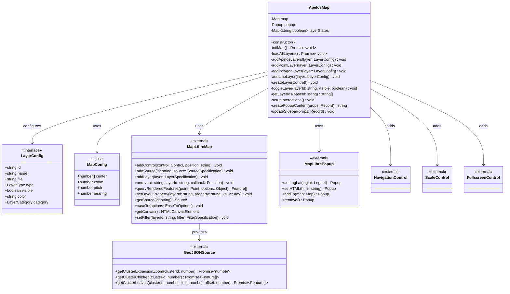

# Architecture Documentation

## System Architecture Diagrams

This document provides detailed visual representations of the application architecture, component relationships, and data flows.

---

## Table of Contents

1. [High-Level Architecture](#high-level-architecture)
2. [Component Architecture](#component-architecture)
3. [Data Flow Architecture](#data-flow-architecture)
4. [Deployment Architecture](#deployment-architecture)
5. [Class Design](#class-design)
6. [State Management](#state-management)
7. [Event System](#event-system)

---

## High-Level Architecture

### System Overview

```
┌─────────────────────────────────────────────────────────────────┐
│                        User Interface Layer                      │
│  ┌──────────────┐  ┌──────────────┐  ┌──────────────────────┐  │
│  │   Sidebar    │  │   Map View   │  │   Layer Control      │  │
│  │   Panel      │  │              │  │   Panel              │  │
│  │              │  │              │  │                      │  │
│  │ - Header     │  │ - MapLibre   │  │ - Layer Toggles     │  │
│  │ - Info Panel │  │ - Popups     │  │ - Collapsible       │  │
│  │ - Footer     │  │ - Controls   │  │ - Color Indicators  │  │
│  └──────────────┘  └──────────────┘  └──────────────────────┘  │
└─────────────────────────────────────────────────────────────────┘
                              ↓
┌─────────────────────────────────────────────────────────────────┐
│                     Application Logic Layer                      │
│  ┌──────────────────────────────────────────────────────────┐  │
│  │                    ApelosMap Class                        │  │
│  │                                                            │  │
│  │  ┌──────────────┐  ┌──────────────┐  ┌──────────────┐   │  │
│  │  │     Map      │  │    Layer     │  │    Event     │   │  │
│  │  │ Initialization│  │  Management  │  │   Handling   │   │  │
│  │  └──────────────┘  └──────────────┘  └──────────────┘   │  │
│  │                                                            │  │
│  │  ┌──────────────┐  ┌──────────────┐  ┌──────────────┐   │  │
│  │  │    Popup     │  │     UI       │  │    State     │   │  │
│  │  │    Control   │  │  Generation  │  │  Management  │   │  │
│  │  └──────────────┘  └──────────────┘  └──────────────┘   │  │
│  └──────────────────────────────────────────────────────────┘  │
└─────────────────────────────────────────────────────────────────┘
                              ↓
┌─────────────────────────────────────────────────────────────────┐
│                        Data Access Layer                         │
│  ┌──────────────┐  ┌──────────────┐  ┌──────────────────────┐  │
│  │   GeoJSON    │  │   MapTiler   │  │   Configuration      │  │
│  │   Files      │  │   API        │  │   Data               │  │
│  │              │  │              │  │                      │  │
│  │ - Apelos     │  │ - Basemap    │  │ - MAP_CONFIG        │  │
│  │ - Bairros    │  │ - Tiles      │  │ - LAYERS            │  │
│  │              │  │ - Styles     │  │ - Environment Vars  │  │
│  └──────────────┘  └──────────────┘  └──────────────────────┘  │
└─────────────────────────────────────────────────────────────────┘
```

### Technology Stack Layers

```
┌─────────────────────────────────────────┐
│         Presentation Layer               │
│  HTML5 • CSS3 • TypeScript               │
└─────────────────────────────────────────┘
                  ↓
┌─────────────────────────────────────────┐
│         Framework Layer                  │
│  Vite • MapLibre GL JS                   │
└─────────────────────────────────────────┘
                  ↓
┌─────────────────────────────────────────┐
│         Data Layer                       │
│  GeoJSON • MapTiler API                  │
└─────────────────────────────────────────┘
                  ↓
┌─────────────────────────────────────────┐
│         Build Layer                      │
│  TypeScript Compiler • Terser • Rollup   │
└─────────────────────────────────────────┘
                  ↓
┌─────────────────────────────────────────┐
│         Deployment Layer                 │
│  Vercel • Netlify • GitHub Pages • Docker│
└─────────────────────────────────────────┘
```

---

## Component Architecture

### Component Hierarchy

```
┌────────────────────────────────────────────────────────┐
│                     Application Root                    │
│                      (#app div)                         │
│                                                          │
│  ┌──────────────────┐    ┌──────────────────────────┐  │
│  │                  │    │                          │  │
│  │   Map Container  │    │    Sidebar Container     │  │
│  │     (#map)       │    │     (.sidebar)           │  │
│  │                  │    │                          │  │
│  │  ┌────────────┐  │    │  ┌────────────────────┐ │  │
│  │  │  MapLibre  │  │    │  │  Sidebar Header    │ │  │
│  │  │  Instance  │  │    │  │  (.sidebar-header) │ │  │
│  │  └────────────┘  │    │  └────────────────────┘ │  │
│  │                  │    │                          │  │
│  │  ┌────────────┐  │    │  ┌────────────────────┐ │  │
│  │  │   Layer    │  │    │  │   Info Panel       │ │  │
│  │  │  Control   │  │    │  │  (#info)           │ │  │
│  │  │  Panel     │  │    │  │  (.info-panel)     │ │  │
│  │  └────────────┘  │    │  └────────────────────┘ │  │
│  │                  │    │                          │  │
│  │  ┌────────────┐  │    │  ┌────────────────────┐ │  │
│  │  │   Popup    │  │    │  │  Sidebar Footer    │ │  │
│  │  │ (floating) │  │    │  │  (.sidebar-footer) │ │  │
│  │  └────────────┘  │    │  └────────────────────┘ │  │
│  │                  │    │                          │  │
│  └──────────────────┘    └──────────────────────────┘  │
│                                                          │
└────────────────────────────────────────────────────────┘
```

### Component Interaction Flow


### Layer Control Component

```
┌─────────────────────────────────────────────┐
│         Layer Control Panel                  │
│         (.layer-control)                     │
│                                               │
│  ┌─────────────────────────────────────────┐ │
│  │  Header (.layer-control-header)         │ │
│  │  ┌──────────────────┐  ┌─────────────┐ │ │
│  │  │ Camadas do Mapa  │  │  Toggle Btn │ │ │
│  │  └──────────────────┘  └─────────────┘ │ │
│  └─────────────────────────────────────────┘ │
│                                               │
│  ┌─────────────────────────────────────────┐ │
│  │  Content (.layer-control-content)       │ │
│  │                                          │ │
│  │  ┌────────────────────────────────────┐ │ │
│  │  │  Layer Group (.layer-group)        │ │ │
│  │  │                                     │ │ │
│  │  │  ┌──────────────────────────────┐ │ │ │
│  │  │  │ Layer Item (.layer-item)     │ │ │ │
│  │  │  │ ☑ ■ Layer Name               │ │ │ │
│  │  │  └──────────────────────────────┘ │ │ │
│  │  │                                     │ │ │
│  │  │  ┌──────────────────────────────┐ │ │ │
│  │  │  │ Layer Item (.layer-item)     │ │ │ │
│  │  │  │ ☐ ■ Layer Name               │ │ │ │
│  │  │  └──────────────────────────────┘ │ │ │
│  │  │                                     │ │ │
│  │  └────────────────────────────────────┘ │ │
│  │                                          │ │
│  └─────────────────────────────────────────┘ │
│                                               │
└─────────────────────────────────────────────┘
```

---

## Data Flow Architecture

### Application Initialization Flow


### User Interaction Flow


### Data Transformation Pipeline


---

## Deployment Architecture

### Build Process Flow


### Deployment Target Architectures

#### Vercel Architecture

```
┌─────────────────────────────────────────────┐
│            User Browser                      │
└─────────────────────────────────────────────┘
                    ↓
┌─────────────────────────────────────────────┐
│         Vercel Edge Network                  │
│  ┌────────────────────────────────────────┐ │
│  │  Edge Cache (Global CDN)               │ │
│  │  - Static Assets (1 year)              │ │
│  │  - HTML (no cache)                     │ │
│  │  - GeoJSON (1 hour)                    │ │
│  └────────────────────────────────────────┘ │
└─────────────────────────────────────────────┘
                    ↓
┌─────────────────────────────────────────────┐
│         Vercel Build                         │
│  ┌────────────────────────────────────────┐ │
│  │  Build Process                         │ │
│  │  1. npm install                        │ │
│  │  2. Inject env vars                    │ │
│  │  3. npm run build                      │ │
│  │  4. Deploy to edge                     │ │
│  └────────────────────────────────────────┘ │
└─────────────────────────────────────────────┘
```

#### Docker Architecture

```
┌─────────────────────────────────────────────┐
│          Docker Container                    │
│                                               │
│  ┌────────────────────────────────────────┐ │
│  │         Nginx (Alpine)                 │ │
│  │                                         │ │
│  │  ┌──────────────────────────────────┐ │ │
│  │  │  /usr/share/nginx/html           │ │ │
│  │  │                                   │ │ │
│  │  │  - index.html                    │ │ │
│  │  │  - assets/                       │ │ │
│  │  │    - *.js (gzipped)              │ │ │
│  │  │    - *.css (gzipped)             │ │ │
│  │  │  - data/                         │ │ │
│  │  │    - *.geojson                   │ │ │
│  │  └──────────────────────────────────┘ │ │
│  │                                         │ │
│  │  ┌──────────────────────────────────┐ │ │
│  │  │  nginx.conf                      │ │ │
│  │  │  - gzip enabled                  │ │ │
│  │  │  - cache headers                 │ │ │
│  │  │  - SPA fallback                  │ │ │
│  │  └──────────────────────────────────┘ │ │
│  └────────────────────────────────────────┘ │
│                                               │
│  Port: 80 → Host Port: 8080                  │
└─────────────────────────────────────────────┘
```

### Multi-Stage Docker Build

```
┌──────────────────────────────────┐
│      Stage 1: Builder             │
│   FROM node:20-alpine             │
│                                    │
│  1. COPY package*.json            │
│  2. RUN npm ci                    │
│  3. COPY source files             │
│  4. RUN npm run build             │
│  5. Output: /app/dist             │
└──────────────────────────────────┘
                ↓
┌──────────────────────────────────┐
│    Stage 2: Production            │
│   FROM nginx:alpine               │
│                                    │
│  1. COPY nginx.conf               │
│  2. COPY --from=builder /app/dist │
│  3. EXPOSE 80                     │
│  4. CMD nginx                     │
└──────────────────────────────────┘
```

---

## Class Design

### UML Class Diagram (Detailed)



### Object Relationship Diagram

```
┌─────────────────────────────────────┐
│         ApelosMap Instance           │
│                                       │
│  ┌─────────────────────────────┐   │
│  │ Properties:                  │   │
│  │ - map: MapLibre.Map          │   │
│  │ - popup: MapLibre.Popup      │   │
│  │ - layerStates: Map<str,bool> │   │
│  └─────────────────────────────┘   │
│                                       │
│         Has-A Relationships           │
└─────────────────────────────────────┘
        │              │              │
        ↓              ↓              ↓
┌──────────────┐  ┌──────────┐  ┌──────────────┐
│ MapLibre.Map │  │  Popup   │  │ layerStates  │
│              │  │          │  │   Map        │
│ - sources    │  │ - lngLat │  │              │
│ - layers     │  │ - html   │  │ apelos: true │
│ - events     │  │ - visible│  │ bairros:false│
└──────────────┘  └──────────┘  └──────────────┘
```

---

## State Management

### Layer State Management


### Application State Lifecycle

```
┌────────────────────────────────────────┐
│          UNINITIALIZED                  │
│  - No map instance                      │
│  - No layers loaded                     │
└────────────────────────────────────────┘
                  ↓
          new ApelosMap()
                  ↓
┌────────────────────────────────────────┐
│          INITIALIZING                   │
│  - Creating map instance                │
│  - Adding controls                      │
│  - Waiting for map load                 │
└────────────────────────────────────────┘
                  ↓
           'load' event
                  ↓
┌────────────────────────────────────────┐
│          LOADING LAYERS                 │
│  - Fetching GeoJSON files               │
│  - Adding sources                       │
│  - Adding layers                        │
└────────────────────────────────────────┘
                  ↓
       All layers loaded
                  ↓
┌────────────────────────────────────────┐
│          SETTING UP                     │
│  - Registering event handlers           │
│  - Creating UI controls                 │
└────────────────────────────────────────┘
                  ↓
        Setup complete
                  ↓
┌────────────────────────────────────────┐
│          READY / IDLE                   │
│  - Map is interactive                   │
│  - Waiting for user input               │
│  - All features functional              │
└────────────────────────────────────────┘
                  ↓
         User interacts
                  ↓
┌────────────────────────────────────────┐
│          PROCESSING                     │
│  - Handling click/hover events          │
│  - Updating UI                          │
│  - Animating transitions                │
└────────────────────────────────────────┘
                  ↓
         Action complete
                  ↓
        Return to READY
```

---

## Event System

### Event Flow Architecture

```
┌──────────────────────────────────────────────────────────┐
│                    Browser Events                         │
│  Mouse Click, Mouse Move, Touch Events, Keyboard, etc.   │
└──────────────────────────────────────────────────────────┘
                          ↓
┌──────────────────────────────────────────────────────────┐
│                 MapLibre Event System                     │
│  - Normalizes events across browsers                      │
│  - Maps to geographic coordinates                         │
│  - Queries rendered features                              │
└──────────────────────────────────────────────────────────┘
                          ↓
┌──────────────────────────────────────────────────────────┐
│                Application Event Handlers                 │
│                                                            │
│  ┌─────────────────┐  ┌─────────────────┐               │
│  │  Click Events   │  │  Hover Events   │               │
│  │                 │  │                 │               │
│  │ - Cluster       │  │ - Enter Cluster │               │
│  │ - Point         │  │ - Enter Point   │               │
│  │                 │  │ - Leave Layer   │               │
│  └─────────────────┘  └─────────────────┘               │
│                                                            │
│  ┌─────────────────┐  ┌─────────────────┐               │
│  │  Change Events  │  │  Map Events     │               │
│  │                 │  │                 │               │
│  │ - Layer Toggle  │  │ - Move          │               │
│  │ - Control Click │  │ - Zoom          │               │
│  │                 │  │ - Load          │               │
│  └─────────────────┘  └─────────────────┘               │
└──────────────────────────────────────────────────────────┘
                          ↓
┌──────────────────────────────────────────────────────────┐
│                 Application State Updates                 │
│  - Update layerStates Map                                 │
│  - Modify map properties                                  │
│  - Update DOM elements                                    │
└──────────────────────────────────────────────────────────┘
                          ↓
┌──────────────────────────────────────────────────────────┐
│                   Visual Feedback                         │
│  - Map re-renders                                         │
│  - Popup displays                                         │
│  - Cursor changes                                         │
│  - Animations play                                        │
└──────────────────────────────────────────────────────────┘
```

### Event Handler Registration

```typescript
// Registration happens in setupInteractions()

map.on('click', 'apelos-clusters', handler)
    ↓
    Registered with MapLibre event system
    ↓
    Handler called when event fires on that layer
    ↓
    Handler executes application logic
```

### Event Propagation

```
User Click on Point
        ↓
Browser MouseEvent
        ↓
MapLibre captures event
        ↓
Query features at click point
        ↓
Find 'apelos-points' layer
        ↓
Check registered handlers
        ↓
Call handler with MapLayerMouseEvent
        ↓
        ├─► Extract feature properties
        ├─► Create popup HTML
        ├─► Position popup at coordinates
        ├─► Update sidebar content
        └─► Display to user
```

---

## Performance Architecture

### Rendering Pipeline


### Clustering Performance

```
Low Zoom (Wide View)
        ↓
Many features visible
        ↓
Clustering algorithm groups nearby points
        ↓
Render ~20-50 clusters instead of 1000+ points
        ↓
60 FPS maintained
        
High Zoom (Close View)
        ↓
Fewer features visible
        ↓
Points spread out, clustering disabled
        ↓
Render ~10-100 individual points
        ↓
60 FPS maintained
```

### Memory Management

```
┌────────────────────────────────────┐
│         Heap Memory                 │
│                                      │
│  ┌──────────────────────────────┐ │
│  │ MapLibre Instance            │ │
│  │ - WebGL Context              │ │
│  │ - Tile Cache (50MB)          │ │
│  └──────────────────────────────┘ │
│                                      │
│  ┌──────────────────────────────┐ │
│  │ GeoJSON Sources              │ │
│  │ - Apelos (~500KB)            │ │
│  │ - Bairros (~200KB)           │ │
│  └──────────────────────────────┘ │
│                                      │
│  ┌──────────────────────────────┐ │
│  │ Application State            │ │
│  │ - Layer States Map (~1KB)    │ │
│  │ - Event Handlers (~10KB)     │ │
│  └──────────────────────────────┘ │
│                                      │
│  Total: ~60-80MB                     │
└────────────────────────────────────┘
```

---

## Security Architecture

### Content Security Policy

```
┌─────────────────────────────────────┐
│         Browser                      │
│                                       │
│  Enforces CSP Headers:                │
│  - script-src 'self'                  │
│  - connect-src 'self' api.maptiler   │
│  - img-src 'self' data: api.maptiler │
│  - style-src 'self' 'unsafe-inline'  │
└─────────────────────────────────────┘
                ↓
        Blocks unauthorized:
        - Scripts from other domains
        - API calls to unknown servers
        - Image loads from untrusted sources
```

### Environment Variable Security

```
Development:
  .env file (gitignored)
        ↓
  Vite reads at build time
        ↓
  Injects into code as string literal
        ↓
  No runtime exposure

Production:
  Platform environment variables
        ↓
  Injected during build process
        ↓
  Bundled into static files
        ↓
  Key visible in client (restrict domain in MapTiler)
```

---

## Scalability Considerations

### Horizontal Scaling (CDN)

```
┌──────────────────────────────────────────────┐
│              Global Users                     │
│  Asia • Europe • Americas • Africa            │
└──────────────────────────────────────────────┘
                    ↓
┌──────────────────────────────────────────────┐
│           CDN Edge Locations                  │
│  ┌────────┐  ┌────────┐  ┌────────┐         │
│  │ Tokyo  │  │ London │  │ São Paulo│        │
│  │ Cache  │  │ Cache  │  │  Cache   │        │
│  └────────┘  └────────┘  └────────┘         │
└──────────────────────────────────────────────┘
                    ↓
            Lowest latency served
```

### Data Scaling

```
Current: ~1000 features
        ↓
Future: 10,000+ features
        ↓
Solutions:
  1. Vector Tiles (PMTiles)
  2. Server-side filtering
  3. Progressive loading
  4. Viewport-based queries
```

---

*This architecture documentation is maintained alongside code changes*

*Last Updated: October 2025*


