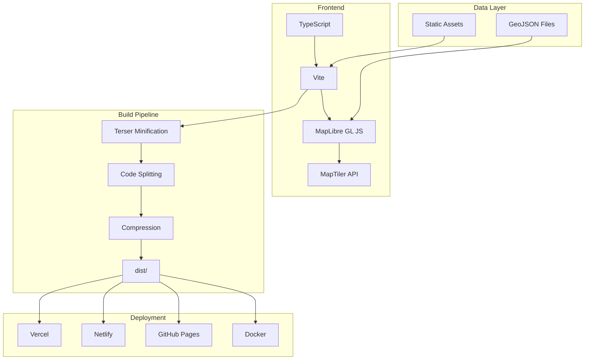
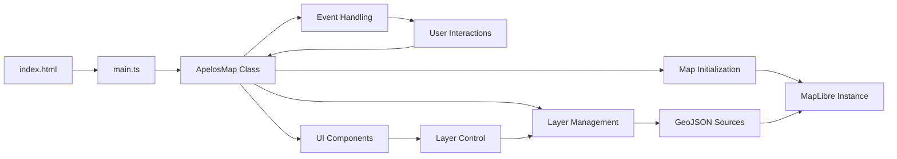
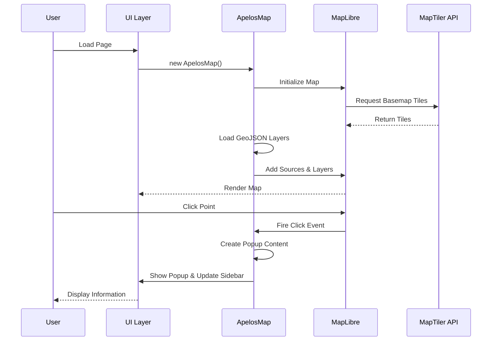
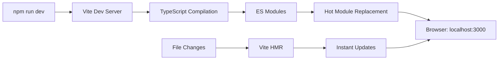
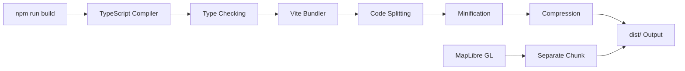
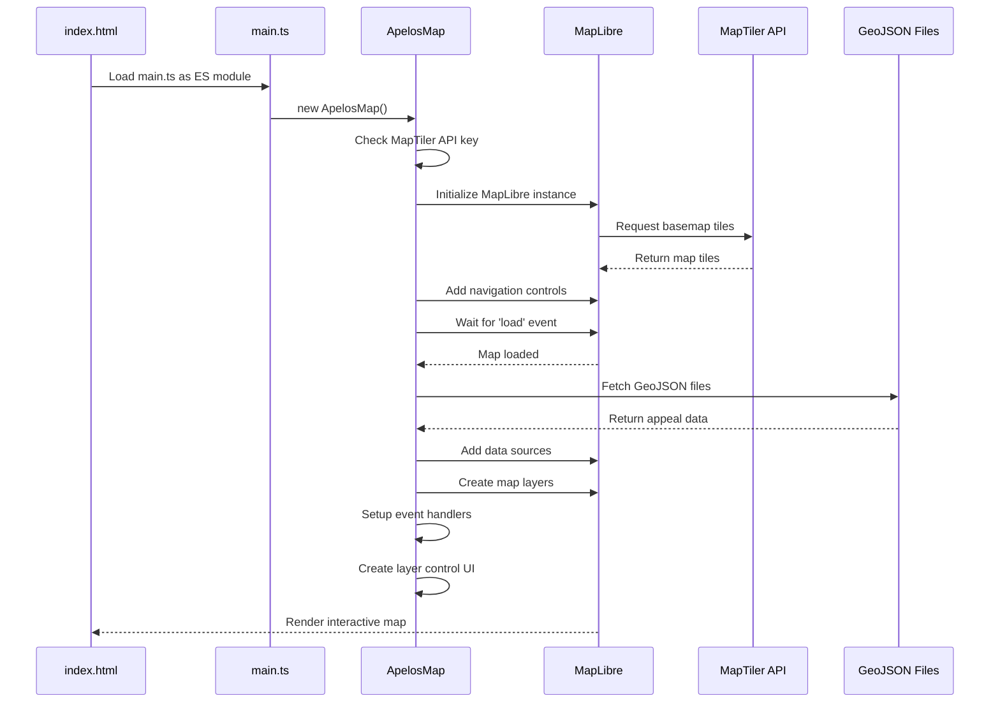
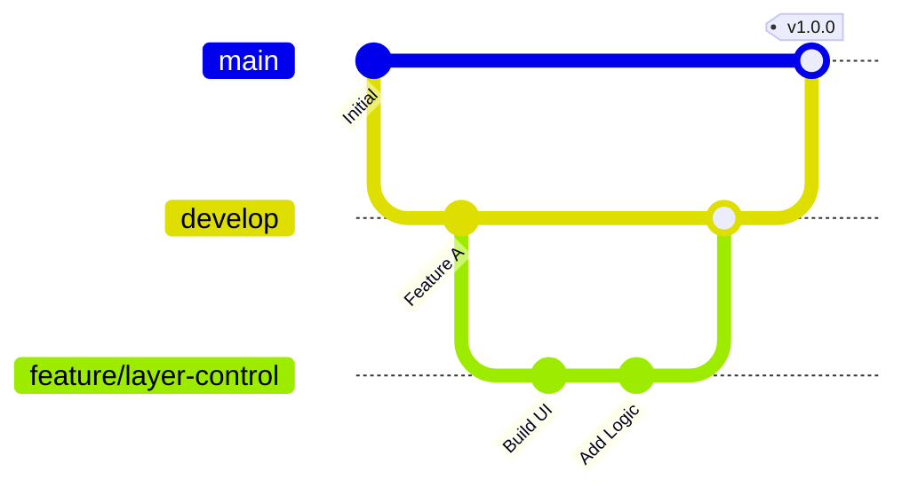
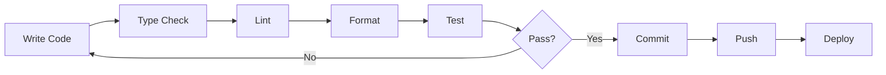

# Developer Guide

## Table of Contents

1. [Development Setup](#development-setup)
2. [Architecture Overview](#architecture-overview)
3. [Code Organization](#code-organization)
4. [Development Workflow](#development-workflow)
5. [Testing Strategy](#testing-strategy)
6. [Performance Optimization](#performance-optimization)
7. [Deployment Process](#deployment-process)
8. [Contributing Guidelines](#contributing-guidelines)

---

## Development Setup

### Prerequisites

| Tool | Version | Purpose |
|------|---------|---------|
| Node.js | 20+ | JavaScript runtime |
| npm | 9+ | Package manager |
| Git | 2.30+ | Version control |
| VS Code | Latest | Recommended IDE |

### Recommended VS Code Extensions

```json
{
  "recommendations": [
    "dbaeumer.vscode-eslint",
    "esbenp.prettier-vscode",
    "bradlc.vscode-tailwindcss",
    "mapbox.mapbox-gl-js",
    "streetsidesoftware.code-spell-checker"
  ]
}
```

### Initial Setup

```bash
# Clone repository
git clone https://github.com/yourusername/geo.git
cd geo/web

# Install dependencies
npm install

# Create environment file
cp env.example .env

# Add your MapTiler key
echo "VITE_MAPTILER_KEY=pk.xxxxx" >> .env

# Start development server
npm run dev
```

### Environment Variables

```bash
# Required
VITE_MAPTILER_KEY=your_api_key_here

# Optional
VITE_APP_TITLE=Custom Title
VITE_APP_DESCRIPTION=Custom Description
NODE_ENV=development
```

---

## Architecture Overview

### Technology Stack



### Application Architecture



### Data Flow



---

## Code Organization

### File Structure

```
web/
├── src/
│   ├── main.ts                 # Application entry point
│   │   ├── Imports & Config    # Lines 1-48
│   │   ├── ApelosMap Class     # Lines 50-493
│   │   └── Initialization      # Lines 495-497
│   │
│   ├── style.css               # Global styles
│   │   ├── Variables           # Lines 7-17
│   │   ├── Base Styles         # Lines 19-45
│   │   ├── Components          # Lines 47-223
│   │   └── Responsive          # Lines 167-191
│   │
│   └── vite-env.d.ts           # Type definitions
│
├── public/
│   └── data/                   # GeoJSON datasets
│       ├── apelos_clean.geojson
│       └── filtro_bairros.geojson
│
├── index.html                  # HTML template
├── vite.config.ts             # Build configuration
├── tsconfig.json              # TypeScript config
└── package.json               # Dependencies
```

### Code Sections

#### main.ts Structure

```typescript
// 1. Imports (Lines 1-4)
import maplibregl from 'maplibre-gl';
import 'maplibre-gl/dist/maplibre-gl.css';
import './style.css';
import type { FeatureCollection } from 'geojson';

// 2. Configuration (Lines 6-48)
const MAPTILER_KEY = import.meta.env.VITE_MAPTILER_KEY || '';
const MAP_CONFIG = { /* ... */ };
const LAYERS: LayerConfig[] = [ /* ... */ ];

// 3. Main Class (Lines 50-493)
class ApelosMap {
  // Properties
  private map!: maplibregl.Map;
  private popup: maplibregl.Popup;
  private layerStates: Map<string, boolean>;
  
  // Methods
  constructor() { /* ... */ }
  private async initMap() { /* ... */ }
  private async loadAllLayers() { /* ... */ }
  // ... more methods
}

// 4. Initialization (Lines 495-497)
new ApelosMap();
```

### Key Design Patterns

#### 1. Singleton Pattern

```typescript
// Only one map instance exists
new ApelosMap();  // Self-executing
```

#### 2. Strategy Pattern

```typescript
// Different rendering strategies per layer type
if (layer.type === 'point') {
  this.addPointLayer(layer);
} else if (layer.type === 'polygon') {
  this.addPolygonLayer(layer);
}
```

#### 3. Observer Pattern

```typescript
// Map events notify application
this.map.on('click', 'apelos-points', (e) => {
  this.showPopup(e.features[0]);
});
```

#### 4. Factory Pattern

```typescript
// Layer creation factory methods
private addApelosLayers(layer: LayerConfig): void
private addPointLayer(layer: LayerConfig): void
private addPolygonLayer(layer: LayerConfig): void
```

---

## Code Execution Flow

Understanding how the application actually runs is crucial for development and debugging. This section explains the complete execution flow from build to runtime.

### Build System & Scripts

The application uses **Vite** as the build tool with the following key scripts from `package.json`:

```json
{
  "scripts": {
    "dev": "vite",                    // Development server
    "build": "tsc && vite build",     // Production build
    "preview": "vite preview",        // Preview built app
    "lint": "eslint . --ext ts,tsx",  // Code linting
    "type-check": "tsc --noEmit"      // Type checking
  }
}
```

### Development vs Production Flow

#### Development Mode (`npm run dev`)



**Process:**
1. **Vite dev server** starts on port 3000
2. **TypeScript compilation** happens on-the-fly (no separate build step)
3. **ES modules** are served directly to the browser
4. **Hot Module Replacement (HMR)** - changes update instantly
5. **Source maps** are generated for debugging

#### Production Mode (`npm run build`)



**Process:**
1. **TypeScript compiler** (`tsc`) checks types and compiles to JavaScript
2. **Vite bundler** processes the code:
   - Bundles all modules into optimized chunks
   - Separates MapLibre GL into its own chunk for better caching
   - Minifies code with Terser
   - Compresses assets (gzip + brotli)
   - Outputs to `dist/` folder

### Application Initialization Sequence

When the page loads, this exact sequence happens:



### Detailed Initialization Code Flow

#### 1. HTML Entry Point
```html
<!-- index.html line 37 -->
<script type="module" src="/src/main.ts"></script>
```

#### 2. TypeScript Module Loading
```typescript
// main.ts lines 1-4: Imports
import maplibregl from 'maplibre-gl';
import 'maplibre-gl/dist/maplibre-gl.css';
import './style.css';
import type { FeatureCollection } from 'geojson';
```

#### 3. Configuration Setup
```typescript
// main.ts lines 15-55: Configuration
const MAPTILER_KEY = import.meta.env.VITE_MAPTILER_KEY || '';
const MAP_CONFIG = {
  center: [-43.1895, -22.9068], // Rio de Janeiro
  zoom: 13,
  // ...
};
const LAYERS: LayerConfig[] = [
  // Layer definitions
];
```

#### 4. Application Constructor
```typescript
// main.ts lines 62-96: Constructor
constructor() {
  // Check API key
  if (!MAPTILER_KEY) {
    // Show error message
    return;
  }
  
  // Create MapLibre instance
  this.map = new maplibregl.Map({
    container: 'map',
    style: `https://api.maptiler.com/maps/streets-v2/style.json?key=${MAPTILER_KEY}`,
    center: MAP_CONFIG.center,
    zoom: MAP_CONFIG.zoom,
  });
  
  this.initMap();
}
```

#### 5. Map Initialization
```typescript
// main.ts lines 98-115: initMap()
private async initMap(): Promise<void> {
  // Add controls
  this.map.addControl(new maplibregl.NavigationControl(), 'top-right');
  this.map.addControl(new maplibregl.ScaleControl(), 'bottom-right');
  this.map.addControl(new maplibregl.FullscreenControl(), 'top-right');
  
  // Wait for map to load
  this.map.on('load', async () => {
    await this.loadAllLayers();
    this.setupInteractions();
    this.createLayerControl();
  });
}
```

#### 6. Data Loading Process
```typescript
// main.ts lines 117-164: loadAllLayers()
private async loadAllLayers(): Promise<void> {
  const basePath = import.meta.env.BASE_URL || '/';
  
  for (const layer of LAYERS) {
    // Fetch GeoJSON data
    const response = await fetch(`${basePath}data/${layer.file}`);
    const data: FeatureCollection = await response.json();
    
    // Add to map based on type
    if (layer.type === 'point' && layer.id === 'apelos') {
      // Special handling for appeals with clustering
      this.map.addSource(layer.id, {
        type: 'geojson',
        data: data,
        cluster: true,
        clusterMaxZoom: 16,
        clusterRadius: 50,
      });
      this.addApelosLayers(layer);
    }
    // ... other layer types
  }
}
```

#### 7. Layer Creation
```typescript
// main.ts lines 166-251: addApelosLayers()
private addApelosLayers(layer: LayerConfig): void {
  // Creates 4 layers:
  // 1. Cluster circles
  // 2. Cluster count labels  
  // 3. Individual points
  // 4. Hover effects
}
```

#### 8. Event Handler Setup
```typescript
// main.ts lines 396-469: setupInteractions()
private setupInteractions(): void {
  // Click on cluster to zoom
  this.map.on('click', 'apelos-clusters', async (e) => {
    // Expand cluster
  });
  
  // Click on point to show popup
  this.map.on('click', 'apelos-points', (e) => {
    // Show popup and update sidebar
  });
  
  // Hover effects
  this.map.on('mouseenter', 'apelos-points', (e) => {
    // Highlight point
  });
}
```

#### 9. UI Component Creation
```typescript
// main.ts lines 318-364: createLayerControl()
private createLayerControl(): void {
  // Creates HTML for layer control panel
  // Adds event listeners for toggles
  // Appends to map container
}
```

### Runtime Behavior

Once fully loaded, the application:

1. **Displays interactive map** centered on Rio de Janeiro
2. **Shows clustered appeals** as clickable points
3. **Provides layer controls** to toggle visibility
4. **Handles user interactions**:
   - Click clusters → zoom to expansion level
   - Click points → show popup with details
   - Hover points → highlight effect
   - Toggle layers → show/hide data
5. **Updates sidebar** with selected appeal information
6. **Manages state** for layer visibility and interactions

### Key Technologies in Execution

| Technology | Role in Execution |
|------------|-------------------|
| **Vite** | Build tool, dev server, bundling |
| **TypeScript** | Type checking, compilation to JS |
| **MapLibre GL JS** | Map rendering, WebGL graphics |
| **MapTiler API** | Provides map tiles and styles |
| **ES Modules** | Module loading system |
| **Fetch API** | Loading GeoJSON data |
| **WebGL** | Hardware-accelerated rendering |

### Environment Variables

The application uses these environment variables:

```bash
# Required for map tiles
VITE_MAPTILER_KEY=pk.your_key_here

# Optional customization
VITE_APP_TITLE=Custom Title
VITE_APP_DESCRIPTION=Custom Description
```

### Build Output Structure

After `npm run build`, the `dist/` folder contains:

```
dist/
├── index.html              # Main HTML file
├── assets/
│   ├── index-[hash].js     # Main application bundle
│   ├── index-[hash].css    # Styles
│   ├── maplibre-[hash].js  # MapLibre GL library
│   └── *.gz, *.br          # Compressed versions
└── data/
    ├── apelos_clean.geojson
    └── filtro_bairros.geojson
```

### Performance Considerations

- **Code splitting**: MapLibre GL is in separate chunk for better caching
- **Compression**: Assets are gzipped and brotli compressed
- **Clustering**: Points are clustered at low zoom levels for performance
- **Lazy loading**: Layers load asynchronously
- **Minification**: Production code is minified and optimized

---

## Development Workflow

### Git Workflow



### Branch Strategy

| Branch | Purpose | Merge To |
|--------|---------|----------|
| `main` | Production-ready code | - |
| `develop` | Integration branch | `main` |
| `feature/*` | New features | `develop` |
| `bugfix/*` | Bug fixes | `develop` |
| `hotfix/*` | Critical fixes | `main` + `develop` |

### Commit Convention

```bash
# Format: <type>(<scope>): <subject>

# Types:
feat:     # New feature
fix:      # Bug fix
docs:     # Documentation
style:    # Formatting
refactor: # Code restructuring
test:     # Tests
chore:    # Build/tooling

# Examples:
git commit -m "feat(map): add layer control panel"
git commit -m "fix(popup): handle missing properties"
git commit -m "docs(api): update method signatures"
```

### Development Cycle



### Daily Workflow

```bash
# 1. Pull latest changes
git checkout develop
git pull origin develop

# 2. Create feature branch
git checkout -b feature/my-feature

# 3. Make changes
# ... edit files ...

# 4. Check types
npm run type-check

# 5. Lint code
npm run lint

# 6. Test locally
npm run dev
# ... test in browser ...

# 7. Build
npm run build
npm run preview

# 8. Commit
git add .
git commit -m "feat(scope): description"

# 9. Push
git push origin feature/my-feature

# 10. Create Pull Request
# ... on GitHub ...
```

---

## Testing Strategy

### Manual Testing Checklist

#### Functionality Tests

- [ ] Map loads with correct center and zoom
- [ ] All layers load successfully
- [ ] Cluster points display at low zoom
- [ ] Individual points show at high zoom
- [ ] Click cluster zooms to expansion level
- [ ] Click point shows popup
- [ ] Popup displays correct information
- [ ] Sidebar updates with popup
- [ ] Layer control toggles visibility
- [ ] Hover effects work correctly

#### Browser Testing

- [ ] Chrome (latest)
- [ ] Firefox (latest)
- [ ] Safari (latest)
- [ ] Edge (latest)
- [ ] Mobile Safari (iOS)
- [ ] Chrome Mobile (Android)

#### Responsive Testing

- [ ] Desktop (1920x1080)
- [ ] Laptop (1366x768)
- [ ] Tablet (768x1024)
- [ ] Mobile (375x667)

### Performance Testing

```bash
# Lighthouse CI
npm install -g @lhci/cli
lhci autorun --upload.target=temporary-public-storage

# Bundle analysis
npm run build -- --mode analyze
```

### Accessibility Testing

```bash
# Install axe-cli
npm install -g @axe-core/cli

# Run accessibility audit
axe http://localhost:3000 --tags wcag2a,wcag2aa
```

### Load Testing

```javascript
// Simulate heavy data load
const features = Array.from({ length: 10000 }, (_, i) => ({
  type: 'Feature',
  geometry: {
    type: 'Point',
    coordinates: [
      -43.1895 + (Math.random() - 0.5) * 0.1,
      -22.9068 + (Math.random() - 0.5) * 0.1
    ]
  },
  properties: { Name: `Point ${i}` }
}));
```

---

## Performance Optimization

### Build Optimization

#### Code Splitting

```typescript
// vite.config.ts
export default defineConfig({
  build: {
    rollupOptions: {
      output: {
        manualChunks: {
          'maplibre': ['maplibre-gl'],  // Separate vendor chunk
        }
      }
    }
  }
});
```

#### Compression

```typescript
// vite.config.ts
import viteCompression from 'vite-plugin-compression';

export default defineConfig({
  plugins: [
    viteCompression({ algorithm: 'gzip' }),
    viteCompression({ algorithm: 'brotliCompress' })
  ]
});
```

#### Minification

```typescript
// vite.config.ts
export default defineConfig({
  build: {
    minify: 'terser',
    terserOptions: {
      compress: {
        drop_console: true,  // Remove console.log in production
        drop_debugger: true
      }
    }
  }
});
```

### Runtime Optimization

#### Clustering Configuration

```typescript
// Optimize cluster rendering
this.map.addSource('apelos', {
  type: 'geojson',
  data: data,
  cluster: true,
  clusterMaxZoom: 16,   // Stop clustering at zoom 17
  clusterRadius: 50,    // 50px radius
});
```

#### Lazy Loading

```typescript
// Load layers on demand
this.map.on('zoom', () => {
  if (this.map.getZoom() > 14 && !this.detailLayersLoaded) {
    this.loadDetailLayers();
    this.detailLayersLoaded = true;
  }
});
```

#### Debouncing

```typescript
// Debounce expensive operations
let timeout: NodeJS.Timeout;
this.map.on('moveend', () => {
  clearTimeout(timeout);
  timeout = setTimeout(() => {
    this.updateVisibleFeatures();
  }, 300);
});
```

### Memory Management

```typescript
// Clean up event listeners
class ApelosMap {
  destroy() {
    this.map.remove();  // Removes all event listeners
    this.popup.remove();
  }
}
```

---

## Deployment Process

### Pre-Deployment Checklist

- [ ] Run type check: `npm run type-check`
- [ ] Run linter: `npm run lint`
- [ ] Build successfully: `npm run build`
- [ ] Test production build: `npm run preview`
- [ ] Check bundle size
- [ ] Verify environment variables
- [ ] Update version in `package.json`
- [ ] Update CHANGELOG.md

### Vercel Deployment

```bash
# Install Vercel CLI
npm install -g vercel

# Login
vercel login

# Deploy to preview
vercel

# Deploy to production
vercel --prod
```

**Environment Variables** (Vercel Dashboard):
- `VITE_MAPTILER_KEY`

### Netlify Deployment

```bash
# Install Netlify CLI
npm install -g netlify-cli

# Login
netlify login

# Deploy
netlify deploy --prod
```

**Environment Variables** (Netlify Dashboard):
- `VITE_MAPTILER_KEY`

### GitHub Pages Deployment

**GitHub Actions Workflow** (`.github/workflows/deploy.yml`):

```yaml
name: Deploy to GitHub Pages

on:
  push:
    branches: [main]

jobs:
  build-and-deploy:
    runs-on: ubuntu-latest
    
    steps:
      - uses: actions/checkout@v3
      
      - name: Setup Node
        uses: actions/setup-node@v3
        with:
          node-version: '20'
      
      - name: Install
        run: |
          cd web
          npm ci
      
      - name: Build
        env:
          VITE_MAPTILER_KEY: ${{ secrets.VITE_MAPTILER_KEY }}
        run: |
          cd web
          npm run build
      
      - name: Deploy
        uses: peaceiris/actions-gh-pages@v3
        with:
          github_token: ${{ secrets.GITHUB_TOKEN }}
          publish_dir: ./web/dist
```

### Docker Deployment

```bash
# Build image
docker build -t apelos-map \
  --build-arg VITE_MAPTILER_KEY=$VITE_MAPTILER_KEY \
  .

# Run container
docker run -p 8080:80 apelos-map

# Visit http://localhost:8080
```

### Custom Server Deployment

```bash
# Build locally
npm run build

# Transfer to server
scp -r dist/ user@server:/var/www/apelos-map/

# Configure nginx
sudo nano /etc/nginx/sites-available/apelos-map

# Restart nginx
sudo systemctl restart nginx
```

---

## Contributing Guidelines

### Code Style

#### TypeScript

```typescript
// Use explicit types
function processFeature(feature: Feature): void {
  // ...
}

// Use interfaces for objects
interface LayerConfig {
  id: string;
  name: string;
  // ...
}

// Use const for immutable values
const MAP_CONFIG = { /* ... */ };

// Use meaningful names
const apelos = data.features.filter(f => f.properties.type === 'apelo');
```

#### CSS

```css
/* Use CSS variables */
.component {
  color: var(--primary-color);
}

/* Use BEM naming */
.layer-control { }
.layer-control__header { }
.layer-control__header--collapsed { }

/* Mobile-first responsive */
.component {
  width: 100%;
}

@media (min-width: 768px) {
  .component {
    width: 50%;
  }
}
```

### Documentation Standards

#### Function Documentation

```typescript
/**
 * Creates clustered point layers for appeals data
 * 
 * Generates four MapLibre layers:
 * - Cluster circles (sized by point count)
 * - Cluster count labels
 * - Individual point circles
 * - Hover effect ring
 * 
 * @param layer - Layer configuration object
 * @returns void
 */
private addApelosLayers(layer: LayerConfig): void {
  // Implementation
}
```

#### README Updates

- Update CHANGELOG.md for all changes
- Update version number
- Add migration notes for breaking changes
- Include code examples

### Pull Request Process

1. **Create Feature Branch**
   ```bash
   git checkout -b feature/my-feature
   ```

2. **Make Changes**
   - Write code
   - Add tests
   - Update documentation

3. **Commit**
   ```bash
   git commit -m "feat(scope): description"
   ```

4. **Push**
   ```bash
   git push origin feature/my-feature
   ```

5. **Create PR**
   - Clear title and description
   - Reference related issues
   - Add screenshots if UI changes
   - Request reviewers

6. **Review Process**
   - Address feedback
   - Update as needed
   - Maintain discussion

7. **Merge**
   - Squash commits
   - Delete feature branch

### PR Template

```markdown
## Description
Brief description of changes

## Type of Change
- [ ] Bug fix
- [ ] New feature
- [ ] Breaking change
- [ ] Documentation update

## Checklist
- [ ] Code follows style guidelines
- [ ] Self-review completed
- [ ] Documentation updated
- [ ] No new warnings
- [ ] Tests added/updated

## Screenshots
(if applicable)

## Related Issues
Closes #123
```

---

## Debugging

### Browser DevTools

```javascript
// Expose map instance for debugging
window.debug = {
  map: this.map,
  layers: LAYERS,
  getFeatures: (layerId) => {
    return this.map.querySourceFeatures(layerId);
  }
};
```

### Common Debug Commands

```javascript
// In browser console

// Get all sources
debug.map.getStyle().sources

// Get all layers
debug.map.getStyle().layers

// Get features at point
debug.map.queryRenderedFeatures([x, y])

// Get cluster children
debug.map.getSource('apelos').getClusterChildren(clusterId)

// Force repaint
debug.map.triggerRepaint()
```

### Performance Profiling

```javascript
// Measure render time
console.time('render');
this.map.on('render', () => {
  console.timeEnd('render');
});

// Track memory usage
console.log(performance.memory);
```

---

## Resources

### Documentation

- [MapLibre GL JS Docs](https://maplibre.org/maplibre-gl-js-docs/)
- [MapTiler Cloud Docs](https://docs.maptiler.com/)
- [Vite Guide](https://vitejs.dev/guide/)
- [TypeScript Handbook](https://www.typescriptlang.org/docs/)

### Tools

- [GeoJSON.io](https://geojson.io/) - GeoJSON editor
- [Mapshaper](https://mapshaper.org/) - Simplify geometries
- [Bundle Phobia](https://bundlephobia.com/) - Check package size
- [Can I Use](https://caniuse.com/) - Browser compatibility

### Community

- [MapLibre Slack](https://slack.openstreetmap.us/)
- [GIS Stack Exchange](https://gis.stackexchange.com/)

---

*Last Updated: October 2025*


