# Web Application - Comprehensive Documentation

## Table of Contents

1. [Overview](#overview)
2. [Architecture](#architecture)
3. [System Design](#system-design)
4. [Class Structure](#class-structure)
5. [Data Flow](#data-flow)
6. [Component Documentation](#component-documentation)
7. [Deployment Architecture](#deployment-architecture)
8. [API Reference](#api-reference)
9. [Configuration](#configuration)
10. [Performance Optimization](#performance-optimization)

---

## Overview

### Purpose
Interactive web mapping application for visualizing historical appeals (apelos) from the Estado Novo period in Rio de Janeiro, specifically related to expropriations for Avenida Presidente Vargas construction.

### Technology Stack

| Layer | Technology | Version | Purpose |
|-------|-----------|---------|---------|
| **Runtime** | Node.js | 20+ | JavaScript runtime |
| **Build Tool** | Vite | 5.4.8 | Fast build and dev server |
| **Language** | TypeScript | 5.6.2 | Type-safe development |
| **Mapping** | MapLibre GL JS | 4.7.1 | Map rendering engine |
| **Map Tiles** | MapTiler | API | Basemap tiles and styles |
| **Data Format** | GeoJSON | - | Geographic data storage |

### Key Features

- ✅ **Point Clustering** - Automatic clustering at low zoom levels
- ✅ **Interactive Popups** - Detailed information on click
- ✅ **Layer Control** - Toggle visibility of map layers
- ✅ **Responsive Design** - Mobile and desktop support
- ✅ **Performance Optimized** - Code splitting, compression, caching
- ✅ **Multi-Deployment** - Supports Vercel, Netlify, GitHub Pages, Docker

---

## Architecture

### High-Level Architecture

```
┌─────────────────────────────────────────────────────────────┐
│                     Web Application                          │
├─────────────────────────────────────────────────────────────┤
│                                                               │
│  ┌────────────┐    ┌──────────────┐    ┌─────────────┐     │
│  │            │    │              │    │             │     │
│  │  HTML/CSS  │───▶│  TypeScript  │───▶│  MapLibre   │     │
│  │  Template  │    │  Application │    │  GL Engine  │     │
│  │            │    │              │    │             │     │
│  └────────────┘    └──────────────┘    └─────────────┘     │
│                            │                    │            │
│                            ▼                    ▼            │
│                    ┌──────────────┐    ┌─────────────┐     │
│                    │   GeoJSON    │    │  MapTiler   │     │
│                    │   Data       │    │  Tiles API  │     │
│                    └──────────────┘    └─────────────┘     │
│                                                               │
└─────────────────────────────────────────────────────────────┘
                            │
                            ▼
┌─────────────────────────────────────────────────────────────┐
│              Deployment Infrastructure                        │
├─────────────────────────────────────────────────────────────┤
│  Vercel  │  Netlify  │  GitHub Pages  │  Docker  │  Custom  │
└─────────────────────────────────────────────────────────────┘
```

### Application Layer Architecture

```
┌──────────────────────────────────────────────────┐
│                 Presentation Layer                │
│  ┌────────────┐  ┌────────────┐  ┌────────────┐ │
│  │  Sidebar   │  │   Map      │  │   Layer    │ │
│  │  Panel     │  │   View     │  │  Control   │ │
│  └────────────┘  └────────────┘  └────────────┘ │
└──────────────────────────────────────────────────┘
                       │
                       ▼
┌──────────────────────────────────────────────────┐
│              Application Logic Layer              │
│  ┌──────────────────────────────────────────┐   │
│  │         ApelosMap Class                   │   │
│  │  ┌────────────────────────────────────┐  │   │
│  │  │ - Map Initialization               │  │   │
│  │  │ - Layer Management                 │  │   │
│  │  │ - Event Handling                   │  │   │
│  │  │ - Popup Control                    │  │   │
│  │  │ - UI State Management              │  │   │
│  │  └────────────────────────────────────┘  │   │
│  └──────────────────────────────────────────┘   │
└──────────────────────────────────────────────────┘
                       │
                       ▼
┌──────────────────────────────────────────────────┐
│                  Data Layer                       │
│  ┌────────────┐  ┌────────────┐  ┌────────────┐ │
│  │  GeoJSON   │  │  MapTiler  │  │   Config   │ │
│  │   Files    │  │    API     │  │   Data     │ │
│  └────────────┘  └────────────┘  └────────────┘ │
└──────────────────────────────────────────────────┘
```

---

## System Design

### Application Flow Diagram

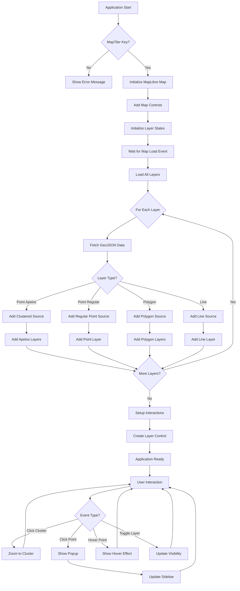

### Layer Loading Sequence

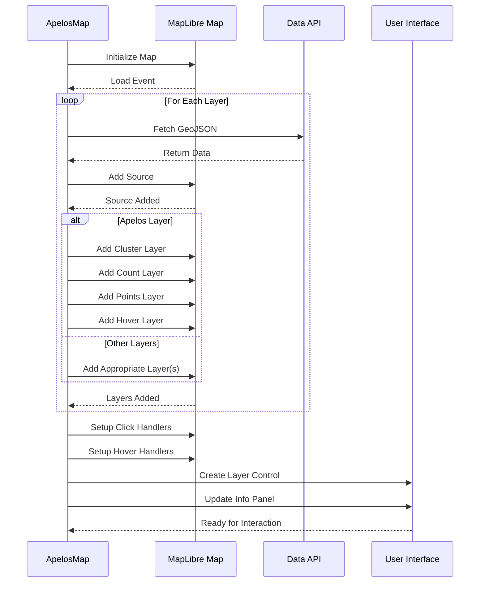

### User Interaction Flow

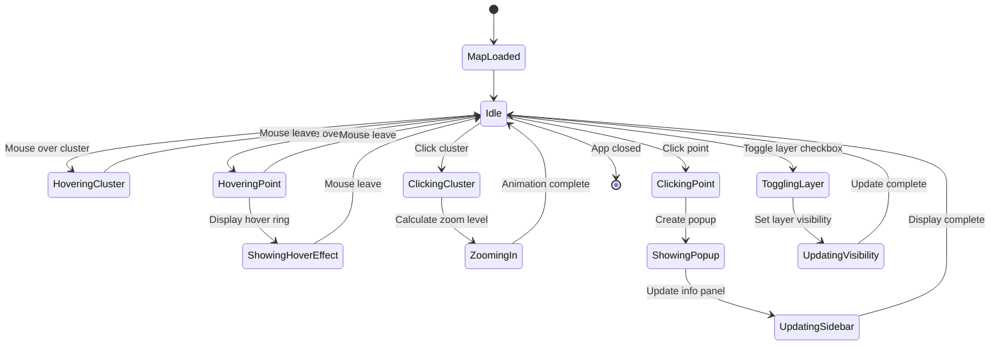

---

## Class Structure

### UML Class Diagram

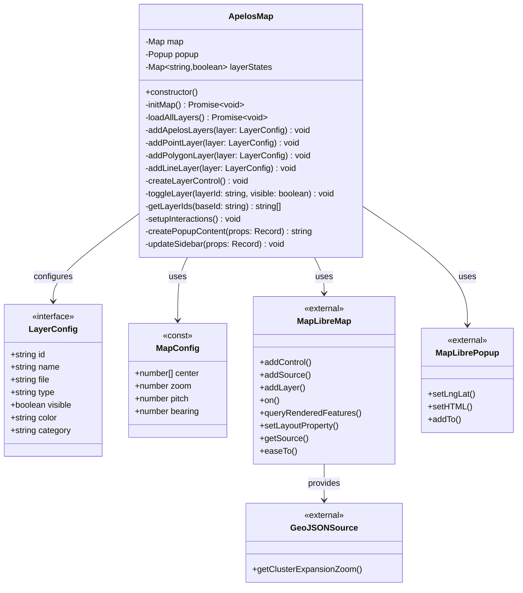

### Class Responsibilities

#### ApelosMap Class

**Single Responsibility**: Manages the entire map application lifecycle

**Key Methods**:

| Method | Responsibility | Async |
|--------|---------------|-------|
| `constructor()` | Initialize map and popup instances | No |
| `initMap()` | Setup map controls and event handlers | Yes |
| `loadAllLayers()` | Fetch and add all data layers | Yes |
| `addApelosLayers()` | Create clustered point layers | No |
| `addPointLayer()` | Create simple point layer | No |
| `addPolygonLayer()` | Create fill and outline layers | No |
| `addLineLayer()` | Create line layer | No |
| `createLayerControl()` | Build layer visibility UI | No |
| `toggleLayer()` | Show/hide map layers | No |
| `setupInteractions()` | Wire up click and hover events | No |
| `createPopupContent()` | Generate popup HTML | No |
| `updateSidebar()` | Update info panel content | No |

---

## Data Flow

### Data Loading Flow

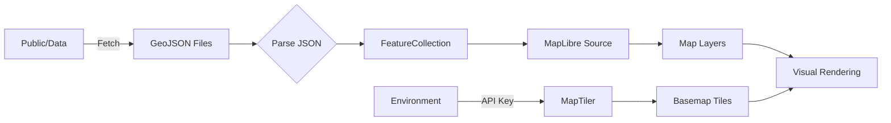

### Event Data Flow

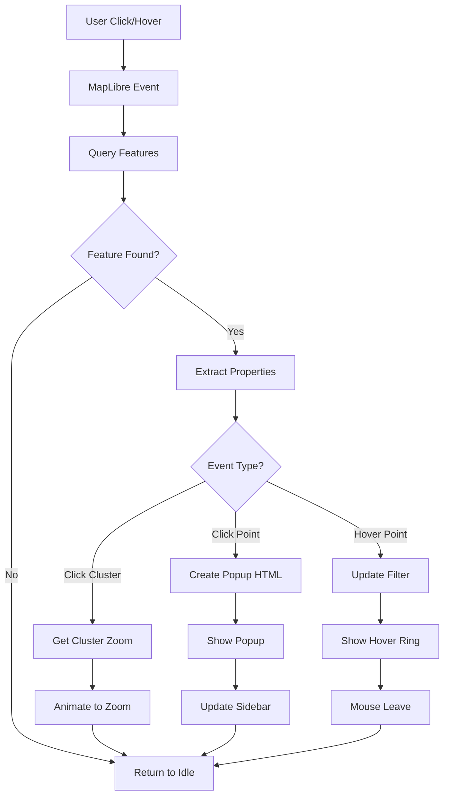

### State Management Flow

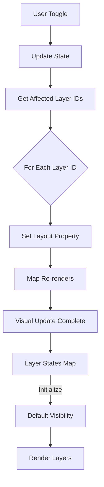

---

## Component Documentation

### 1. Map Initialization

**File**: `src/main.ts` (lines 79-89)

**Purpose**: Creates the main map instance with MapTiler basemap

```typescript
this.map = new maplibregl.Map({
  container: 'map',
  style: `https://api.maptiler.com/maps/streets-v2/style.json?key=${MAPTILER_KEY}`,
  center: MAP_CONFIG.center,
  zoom: MAP_CONFIG.zoom,
  pitch: MAP_CONFIG.pitch,
  bearing: MAP_CONFIG.bearing,
});
```

**Configuration**:
- **Container**: DOM element ID for map rendering
- **Style**: MapTiler style URL with API key
- **Center**: Initial map center `[-43.1895, -22.9068]` (Rio de Janeiro)
- **Zoom**: Initial zoom level (13)

---

### 2. Layer System

#### Layer Types

**Apelos (Clustered Points)**

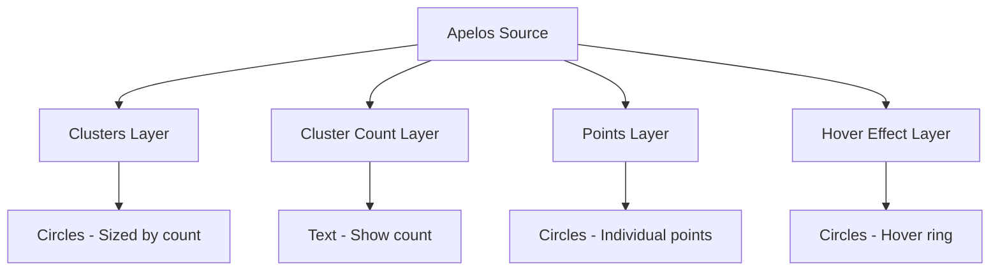

**Configuration**:
- Clustering enabled with `clusterMaxZoom: 16` and `clusterRadius: 50`
- Color coding by point count (yellow → orange → red)
- Circle size increases with cluster size

**Polygon Layers**

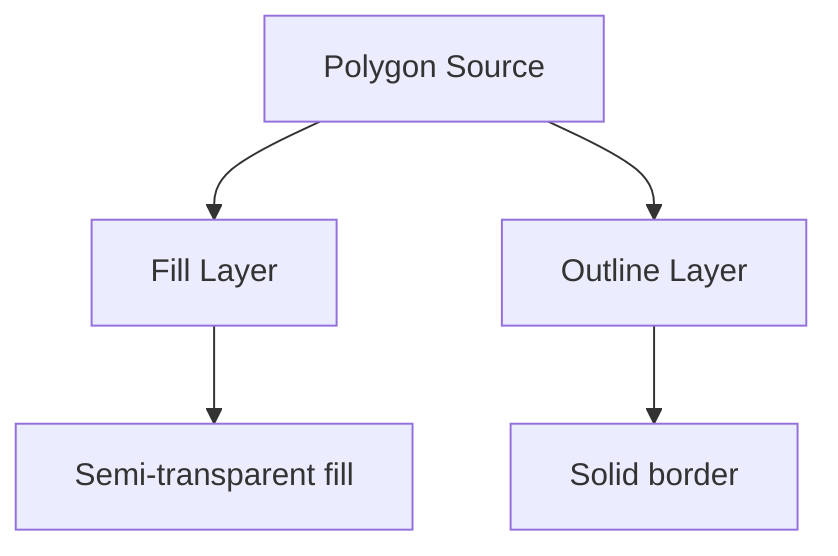

**Point Layers**

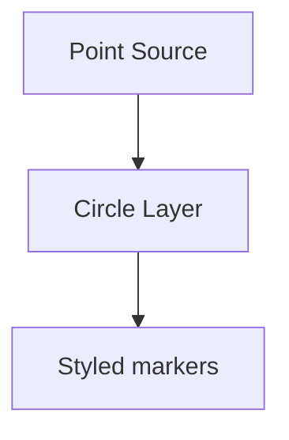

**Line Layers**

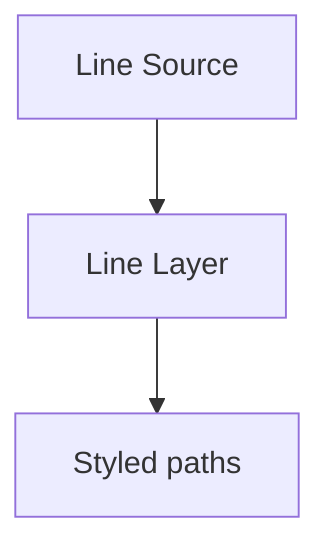

---

### 3. Layer Control Panel

**Location**: Top-right overlay on map

**Structure**:

```
┌─────────────────────────────┐
│ Camadas do Mapa          [▼]│
├─────────────────────────────┤
│ ☑ ■ Apelos (Appeals)        │
│ ☐ ■ Bairros Filtrados       │
└─────────────────────────────┘
```

**Features**:
- Collapsible panel
- Color-coded layer indicators
- Real-time visibility toggle
- Persistent state management

**Implementation** (lines 311-357):
1. Creates DOM structure dynamically
2. Adds checkboxes for each layer
3. Wires change events to `toggleLayer()`
4. Updates all associated map layers

---

### 4. Popup System

**Trigger**: Click on unclustered point

**Content Structure**:

```html
<div class="popup-content">
  <h3>{Name}</h3>
  <p>{Description}</p>
  <a href="{Link}">Ver documento →</a>
</div>
```

**Dual Display**:
1. **Map Popup**: Positioned at feature coordinates
2. **Sidebar Panel**: Synchronized content in left panel

**Data Binding**:
- Reads from GeoJSON feature properties
- Sanitizes and formats content
- Handles missing data gracefully

---

### 5. Interaction System

#### Click Handlers

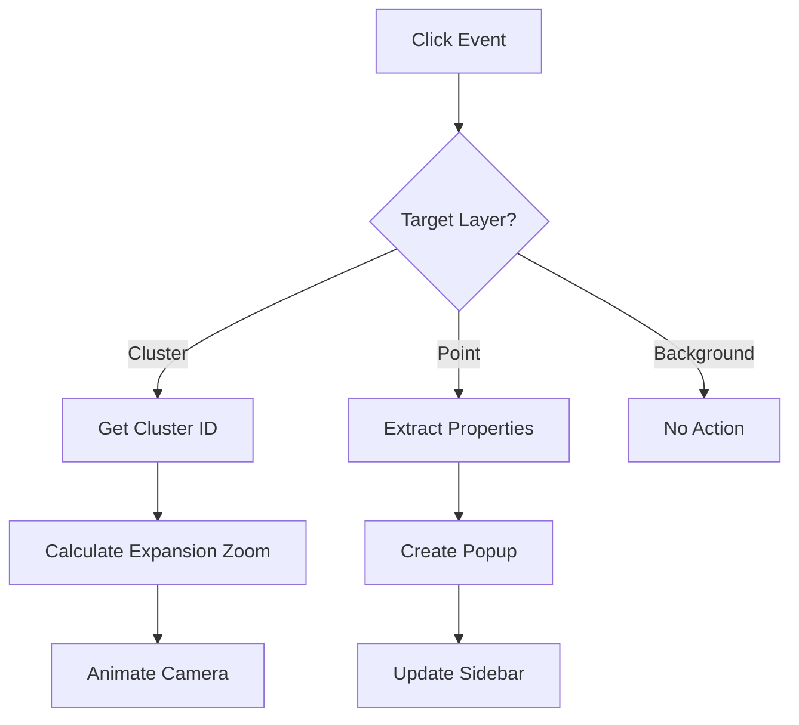

#### Hover Handlers

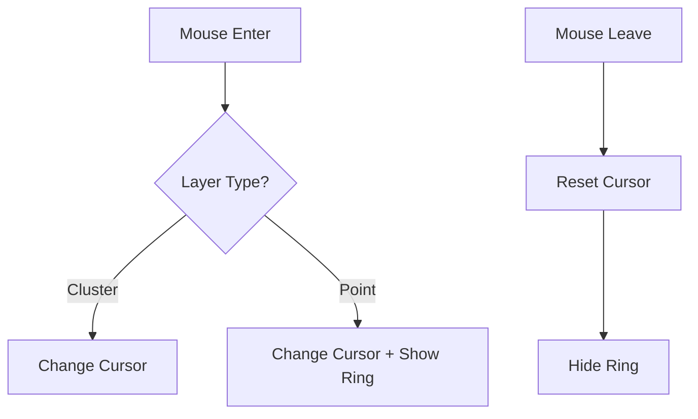

**Implementation Details**:
- Uses MapLibre event system
- Queries rendered features at pixel coordinates
- Filters hover layer dynamically based on feature name

---

## Deployment Architecture

### Multi-Platform Deployment

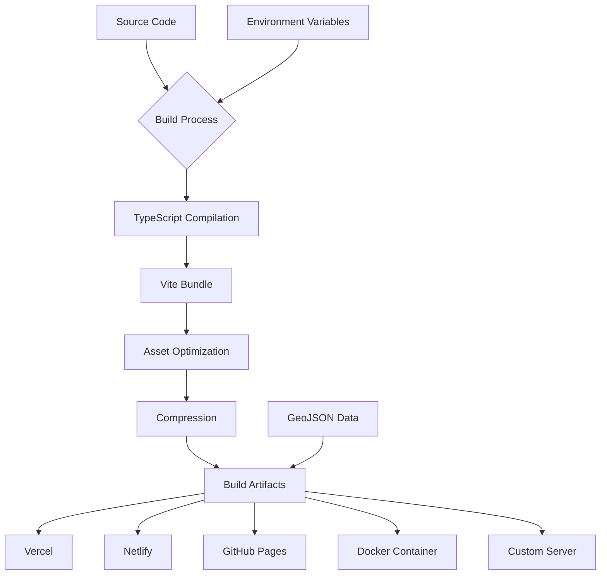

### Build Pipeline

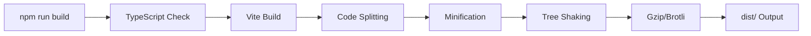

**Optimizations**:
1. **Code Splitting**: MapLibre in separate chunk
2. **Minification**: Terser with console removal
3. **Compression**: Gzip and Brotli variants
4. **Asset Hashing**: Cache-friendly file names

### Deployment Configurations

#### Vercel (`vercel.json`)

```json
{
  "buildCommand": "npm run build",
  "outputDirectory": "dist",
  "framework": "vite"
}
```

**Features**:
- Automatic HTTPS
- Edge caching
- Environment variable injection
- Zero-config deployment

#### Netlify (`netlify.toml`)

```toml
[build]
  command = "npm run build"
  publish = "dist"
```

**Features**:
- Asset optimization
- Header configuration
- Redirect rules
- Form handling

#### Docker (`Dockerfile`)

**Multi-stage Build**:
1. **Stage 1**: Build application
2. **Stage 2**: Nginx production server

**Features**:
- Minimal image size
- Health checks
- Custom nginx config
- Static asset serving

---

## API Reference

### Environment Variables

| Variable | Type | Required | Description |
|----------|------|----------|-------------|
| `VITE_MAPTILER_KEY` | string | ✅ | MapTiler API key for basemap tiles |
| `VITE_APP_TITLE` | string | ❌ | Custom application title |
| `VITE_APP_DESCRIPTION` | string | ❌ | Custom app description |

### Configuration Constants

#### MAP_CONFIG

```typescript
const MAP_CONFIG = {
  center: [-43.1895, -22.9068] as [number, number],
  zoom: 13,
  pitch: 0,
  bearing: 0,
}
```

#### LAYERS

```typescript
interface LayerConfig {
  id: string;           // Unique layer identifier
  name: string;         // Display name
  file: string;         // GeoJSON filename
  type: 'point' | 'polygon' | 'line';
  visible: boolean;     // Initial visibility
  color: string;        // Primary color (hex)
  category: 'main' | 'context';
}
```

### GeoJSON Data Structure

**Expected Feature Properties**:

```typescript
interface ApelosProperties {
  Name?: string;        // Appeal name/title
  Description?: string; // Detailed description
  Link?: string;        // External document URL
}
```

**File Locations**:
- Development: `/public/data/`
- Production: `/dist/data/`

---

## Configuration

### Vite Configuration (`vite.config.ts`)

**Key Settings**:

```typescript
{
  base: '/geo/',              // GitHub Pages path
  build: {
    outDir: 'dist',
    minify: 'terser',
    rollupOptions: {
      output: {
        manualChunks: {
          'maplibre': ['maplibre-gl'],  // Separate chunk
        }
      }
    }
  }
}
```

### TypeScript Configuration (`tsconfig.json`)

**Compiler Options**:
- Target: ES2020
- Module: ESNext
- Strict mode enabled
- Bundle mode for Vite

### Styling System

**CSS Variables** (`src/style.css`):

```css
:root {
  --primary-color: #C1272D;    /* Red */
  --secondary-color: #E8862E;  /* Orange */
  --accent-color: #E8B931;     /* Yellow */
  --text-dark: #2c3e50;
  --text-light: #666;
  --bg-light: #f8f9fa;
  --border-color: #e1e8ed;
  --shadow: 0 2px 8px rgba(0, 0, 0, 0.1);
  --shadow-lg: 0 4px 16px rgba(0, 0, 0, 0.15);
}
```

**Responsive Breakpoints**:
- Mobile: `@media (max-width: 768px)`

---

## Performance Optimization

### Bundle Analysis

**Production Build Size**:

```
dist/
├── index.html           ~2 KB
├── assets/
│   ├── index.[hash].css     ~8 KB (gzipped: ~2 KB)
│   ├── index.[hash].js      ~25 KB (gzipped: ~8 KB)
│   └── maplibre.[hash].js   ~180 KB (gzipped: ~60 KB)
└── data/
    ├── apelos_clean.geojson     ~varies
    └── filtro_bairros.geojson   ~varies
```

### Loading Performance

```mermaid
gantt
    title Page Load Timeline
    dateFormat X
    axisFormat %Ls
    
    section Initial
    HTML Parse      :0, 100
    CSS Load        :100, 200
    JS Parse        :200, 500
    
    section MapLibre
    Library Load    :500, 1500
    Map Init        :1500, 2000
    
    section Data
    GeoJSON Fetch   :2000, 2500
    Layer Render    :2500, 3000
    
    section Interactive
    Event Setup     :3000, 3200
    UI Ready        :3200, 3300
```

### Optimization Strategies

1. **Code Splitting**
   - MapLibre in separate chunk
   - Lazy load non-critical features

2. **Asset Optimization**
   - Terser minification
   - Gzip + Brotli compression
   - Cache headers (1 year for assets)

3. **Runtime Performance**
   - GeoJSON clustering for points
   - Debounced event handlers
   - Efficient DOM updates

4. **Network Optimization**
   - CDN delivery (Vercel/Netlify)
   - HTTP/2 push
   - Preconnect to MapTiler

### Caching Strategy

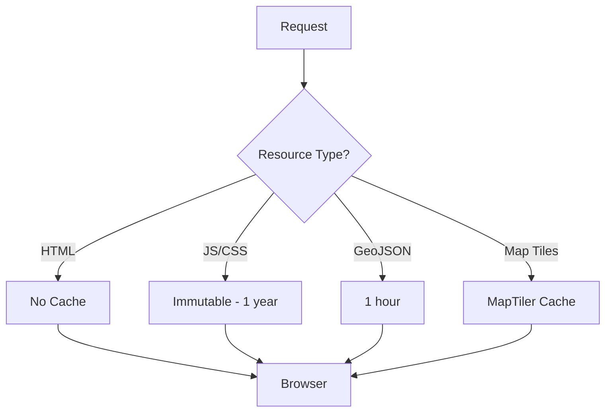

---

## Security Considerations

### Content Security Policy

**Netlify Headers**:
```
X-Frame-Options: DENY
X-XSS-Protection: 1; mode=block
X-Content-Type-Options: nosniff
Referrer-Policy: strict-origin-when-cross-origin
```

### API Key Management

**Best Practices**:
1. ✅ Store in environment variables
2. ✅ Never commit to repository
3. ✅ Use `.env.example` for documentation
4. ✅ Rotate keys periodically
5. ✅ Restrict key domains in MapTiler dashboard

### Data Validation

**GeoJSON Parsing**:
- Type checking for FeatureCollection
- Property existence validation
- Graceful error handling

---

## Testing & Quality Assurance

### Type Safety

**TypeScript Coverage**: 100%

**Key Type Definitions**:
```typescript
import type { FeatureCollection } from 'geojson';

interface LayerConfig { /* ... */ }
type LayerType = 'point' | 'polygon' | 'line';
```

### Browser Support

**Tested Browsers**:
- Chrome 90+ ✅
- Firefox 88+ ✅
- Safari 14+ ✅
- Edge 90+ ✅

**Mobile Devices**:
- iOS Safari 14+ ✅
- Chrome Android 90+ ✅

### Accessibility

**WCAG 2.1 Level AA Compliance**:
- ✅ Keyboard navigation
- ✅ ARIA labels
- ✅ Color contrast ratios
- ✅ Focus indicators
- ✅ Screen reader support

---

## Development Workflow

### Local Development

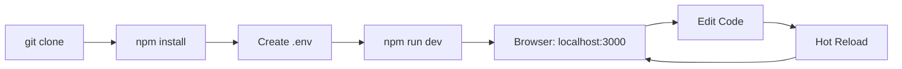

### Production Build

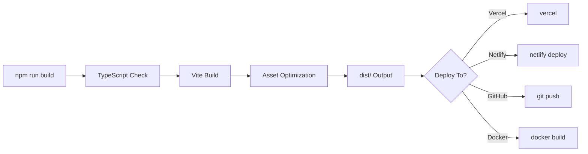

### CI/CD Pipeline

**GitHub Actions** (if configured):

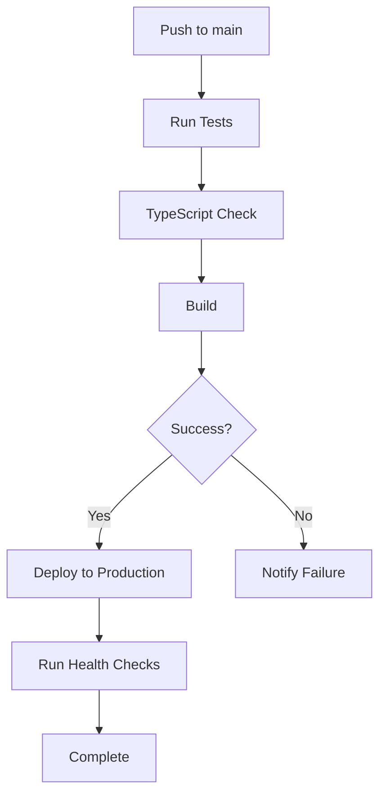

---

## Troubleshooting

### Common Issues

#### 1. MapTiler Key Error

**Symptom**: Error message in sidebar
**Solution**:
1. Get key from https://maptiler.com
2. Add to `.env`: `VITE_MAPTILER_KEY=your_key`
3. Restart dev server

#### 2. GeoJSON Not Loading

**Symptom**: Layers not appearing
**Solution**:
1. Check file paths in `public/data/`
2. Verify GeoJSON structure
3. Check browser console for errors
4. Ensure correct BASE_URL in production

#### 3. Build Failures

**Symptom**: TypeScript errors
**Solution**:
1. Run `npm run type-check`
2. Fix type errors
3. Ensure dependencies are installed
4. Clear cache: `rm -rf node_modules/.vite`

---

## Future Enhancements

### Planned Features

1. **Advanced Filtering**
   - Date range filters
   - Property-based search
   - Multi-layer queries

2. **Data Export**
   - CSV export
   - PDF reports
   - Share links

3. **Analytics**
   - Usage tracking
   - Heatmaps
   - Statistics dashboard

4. **Offline Support**
   - Service worker
   - Cached tiles
   - Local storage

### Performance Roadmap

```mermaid
gantt
    title Optimization Roadmap
    dateFormat YYYY-MM-DD
    
    section Q1
    Implement Service Worker    :2025-01-01, 30d
    Add Vector Tiles           :2025-02-01, 45d
    
    section Q2
    Lazy Load Components       :2025-04-01, 20d
    WebGL Acceleration        :2025-05-01, 30d
    
    section Q3
    Progressive Web App        :2025-07-01, 45d
```

---

## Appendix

### File Structure Reference

```
web/
├── src/
│   ├── main.ts              # Application entry point (497 lines)
│   ├── style.css            # Global styles (373 lines)
│   └── vite-env.d.ts        # Vite type definitions
│
├── public/
│   └── data/
│       ├── apelos_clean.geojson
│       └── filtro_bairros.geojson
│
├── dist/                    # Build output
│   ├── index.html
│   ├── assets/
│   └── data/
│
├── index.html               # HTML template
├── package.json             # Dependencies
├── tsconfig.json            # TypeScript config
├── vite.config.ts           # Build config
│
├── Dockerfile              # Docker configuration
├── docker-compose.yml      # Docker Compose
├── nginx.conf              # Nginx config
├── netlify.toml            # Netlify config
└── vercel.json             # Vercel config
```

### Dependencies

#### Production Dependencies

```json
{
  "maplibre-gl": "^4.7.1",    // Map rendering
  "pmtiles": "^3.0.7"         // Tile format (future use)
}
```

#### Development Dependencies

```json
{
  "@types/geojson": "^7946.0.14",
  "@typescript-eslint/eslint-plugin": "^7.0.0",
  "@typescript-eslint/parser": "^7.0.0",
  "eslint": "^8.57.0",
  "terser": "^5.44.0",
  "typescript": "^5.6.2",
  "vite": "^5.4.8",
  "vite-plugin-compression": "^0.5.1"
}
```

### Glossary

| Term | Definition |
|------|------------|
| **Apelos** | Historical appeals from Estado Novo period |
| **Clustering** | Grouping nearby points at low zoom levels |
| **GeoJSON** | Geographic data format (JSON-based) |
| **MapLibre** | Open-source map rendering library |
| **MapTiler** | Map tile and style provider |
| **Vite** | Fast build tool and dev server |

---

## Contact & Support

**Authors**:
- Francesca Dalmagro Martinelli
- Cristofer Antoni Souza Costa

**Repository**: GitHub
**Issues**: Use GitHub Issues for bug reports
**Documentation**: Updated October 2025

---

*This documentation was generated for web application version 1.0.0*


